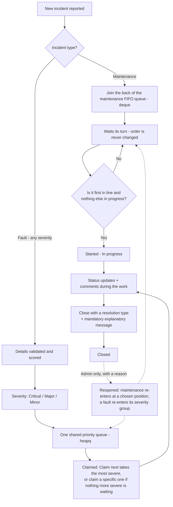
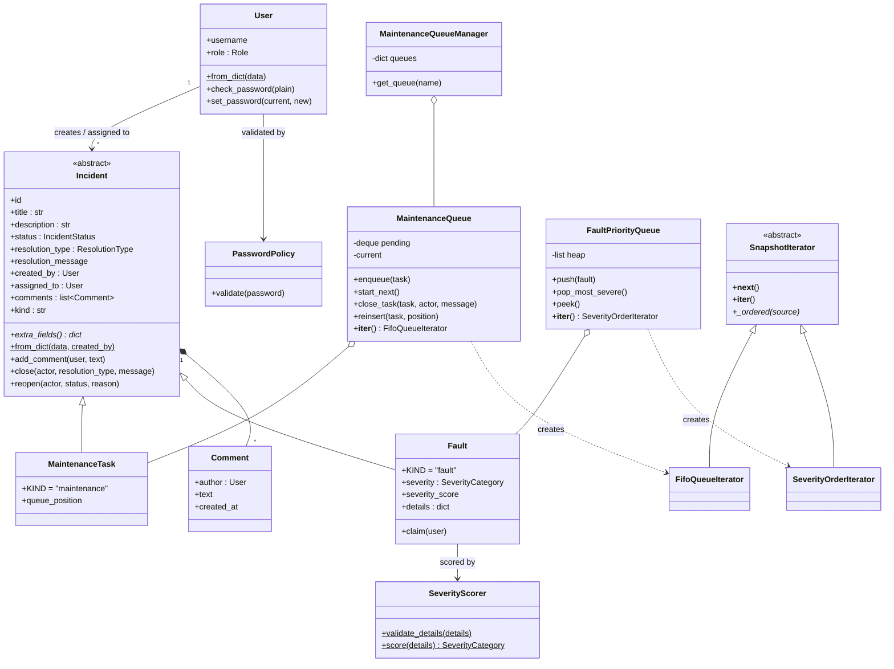
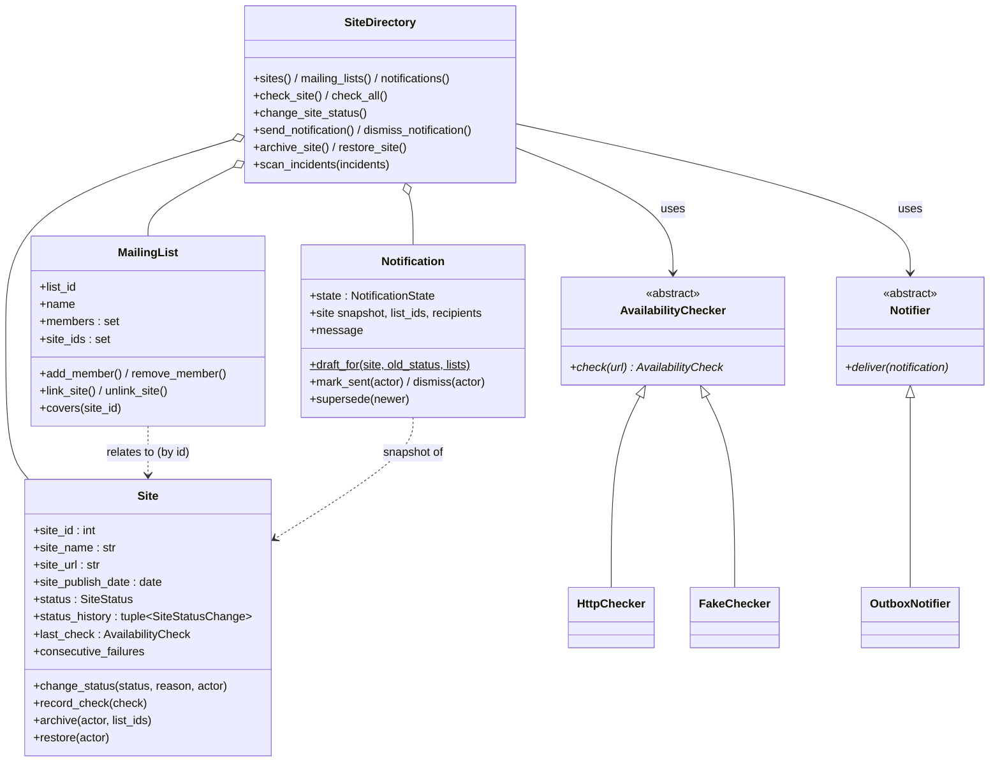
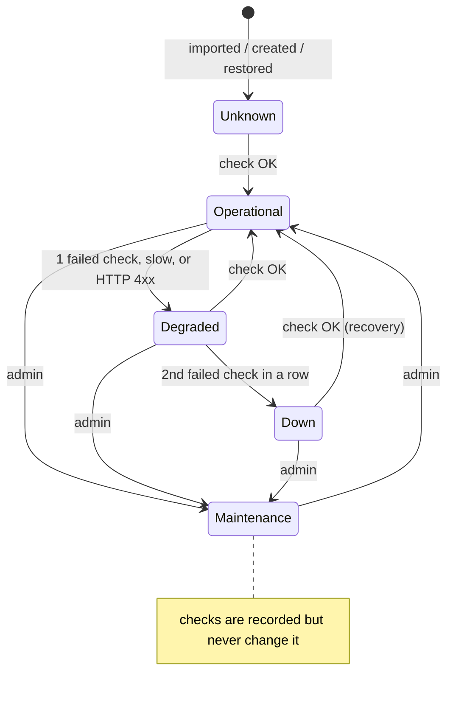
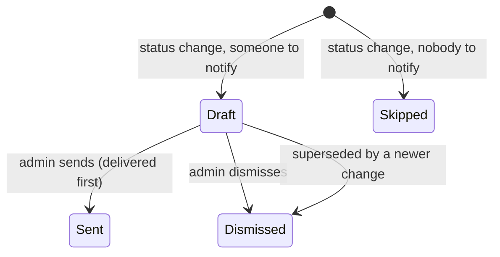

# Incident Bridge

**Status:** v0.3.4 — Stage 1 complete, including the group-of-four extension (Sites & Mailing Lists)
**Course:** Advanced Programming — Project
**Repository:** https://github.com/Daniel-Reuven/Incident_Bridge
**Companion document:** [`AI_USAGE.md`](AI_USAGE.md) — how AI tools were used in this project

Incident Bridge is an internal web system for logging, prioritizing and tracking an organization's IT incidents: routine **maintenance tasks** run in a strict first-in-first-out queue, **faults** of every severity share one priority queue so the most severe is always handled first, and an admin-only **site portal** monitors the organization's websites, notifies the right mailing lists when one has a problem, and shows which open incidents concern which site.

> **Portability note:** this document is self-contained. Anyone picking the project up fresh — a teammate, an instructor, a future session — should be able to understand the business process, the design and the current implementation from this file alone.

**Quick start** (details in [§15](#15-how-to-run-everything)):

```bash
cd backend
pip install -e ".[dev]"      # the app plus its test tools, from pyproject.toml
cp .env.example .env         # then edit it
python serve_app.py          # web app on http://127.0.0.1:8000
cd .. && python main.py      # offline demo of every Stage 1 requirement
```

---

## Contents

- [Part A – Project Proposal](#part-a--project-proposal)
- [1. Business process](#1-business-process)
- [2. Severity scoring](#2-severity-scoring)
- [3. Data structures — what is used where, and why](#3-data-structures--what-is-used-where-and-why)
- [4. The OOP model](#4-the-oop-model)
- [5. Incident lifecycle and actions](#5-incident-lifecycle-and-actions)
- [6. Sites & Mailing Lists subsystem (group-of-four extension)](#6-sites--mailing-lists-subsystem-group-of-four-extension)
- [7. Data files: source, structure, loading and validation](#7-data-files-source-structure-loading-and-validation)
- [8. Collection operations: changing a collection vs. creating a new one](#8-collection-operations-changing-a-collection-vs-creating-a-new-one)
- [9. Iteration: Iterable/Iterator, generator and lazy pipeline](#9-iteration-iterableiterator-generator-and-lazy-pipeline)
- [10. Context managers](#10-context-managers)
- [11. Architecture — as built](#11-architecture--as-built)
- [12. Project structure (file map)](#12-project-structure-file-map)
- [13. Confirmed design decisions](#13-confirmed-design-decisions)
- [14. Automated testing](#14-automated-testing)
- [15. How to run everything](#15-how-to-run-everything)
- [16. Requirements map (where each Stage 1 item lives)](#16-requirements-map-where-each-stage-1-item-lives)
- [Tech stack](#tech-stack)

---

## Part A – Project Proposal

*This is the business proposal submitted for approval in Stage 1, Part A. It contains no code or technical design and is unchanged since approval; the group-of-four extension built afterwards is described in [§6](#6-sites--mailing-lists-subsystem-group-of-four-extension).*

**Project name:** Incident Bridge
**One-sentence description:** An internal system for logging, prioritizing, and tracking routine maintenance tasks and operational faults across an organization's IT environment.

**Business need:** Teams currently lack a structured way to (a) ensure routine maintenance steps happen in the correct order without being skipped, and (b) make sure the most severe faults get attention first instead of being handled in arrival order. This leads to missed maintenance steps and delayed response to critical outages.

**Key users and roles:**
- **Admin** — IT manager / team lead. Full visibility over all incidents, can manage users, reclassify severity, and close incidents (including as "not an incident" or "by design").
- **User** — technician / support agent. Reports incidents, works assigned incidents, updates status, and adds comments.

**Main business process:** An incident is reported and classified as either *maintenance* or *fault/issue*. Maintenance tasks are placed into a strict first-in-first-out queue — a task cannot start before the previous one is completed, and the order can never be changed. Faults of every severity — Critical, Major, and Minor alike — are scored and placed into a single shared priority queue, so the most severe fault is always handled first regardless of when it arrived. Assigned staff update the incident's status and add comments until it is closed with a documented reason.

**Information flow:** Incoming — incident title, description, source system, and relevant details. Created/updated by — the reporting user, the assigned technician, and admins. Produced — a prioritized worklist per incident type, a full comment/update history per incident, and a documented closure reason.

**Business value:** Faster response to critical failures, no skipped or reordered maintenance steps, a clear audit trail of who did what and when (including *why* an incident was closed), reduced downtime, and improved user experience for the organization's internal customers.

**Core entities and relationships (high level):**
- A **User** creates and/or is assigned to **Incidents**.
- An **Incident** is either a **Maintenance Task** or a **Fault**.
- A **Fault** has exactly one **Severity Category** (Critical / Major / Minor), and every fault — regardless of category — goes through the same priority queue.
- An **Incident** has many **Comments**, each written by a **User**, and a mandatory closure message once resolved.

**Two main usage scenarios:**
1. A production system becomes unavailable. It is scored as *Critical*, jumps to the top of the shared fault priority queue ahead of any Major/Minor faults, and the on-call engineer is alerted, resolves it, and documents the steps taken via comments and a closing message.
2. A weekly batch of scheduled server maintenance tasks is queued in sequence. Each task must be marked complete before the next one can start, in strict, unchangeable order — not even an Admin can reorder or skip a task.

**Future expansion idea:** Connect the system to an external monitoring/alerting service so that real-time alerts automatically generate fault incidents instead of requiring manual entry.

---

## 1. Business process



Key rules:
- **Maintenance = order matters, severity doesn't, order is immutable.** Only the first task in line can start, and only when nothing is in progress.
- **Faults = severity matters, arrival order is only the tiebreaker, all severities share one queue.**
- **Every closure — whatever the reason — requires a written explanation**, and every status change is logged as a comment saying who did it and why.
- A pending maintenance task may **leave from any position, but only by being closed with a reason** — the tasks behind it move up; nothing is reordered.
- A closed incident can be **reopened by an admin only**, with a reason (details in [§5](#5-incident-lifecycle-and-actions)).

## 2. Severity scoring

Severity is decided by a dedicated component, `SeverityScorer` (`backend/app/services/severity_scoring.py`), not inside the `Fault` class, so the rules can later be replaced (e.g. by an external rules engine) without touching the domain model or the queue.

- **Input:** a `details` object, every field optional: `system_unavailable`, `security_breach`, `performance_degraded` (true/false) and `affected_users_percent` (0–100) — the four questions on the *New incident → Fault* form. A fifth flag, `cosmetic_only`, is also accepted (the sample data uses it to describe purely visual faults) but does not change the result, because anything that is not Critical or Major is already Minor; that is why the form does not ask for it.
- **Rules:** system unavailable or a security breach → **Critical**; performance degraded or at least 25% of users affected → **Major**; anything else → **Minor**.
- **Validation:** `SeverityScorer.validate_details()` runs first on every path (API and file import): `details` must be an object, only the known fields are allowed (a typo would otherwise silently lower the severity), flags must be true/false and the percentage a number from 0 to 100. Invalid details are an HTTP 400 in the API and a skipped record in an import — never a crash.
- **Categories are fixed** (no others exist) and all three go into the same priority queue: Critical = 1, Major = 2, Minor = 3 — a lower number means more urgent.
- An admin can change a fault's severity afterwards; the fault then moves to its new place in the queue.

## 3. Data structures — what is used where, and why

| Need | Structure | Why it fits | Where |
|---|---|---|---|
| Maintenance tasks handled strictly in arrival order | `collections.deque` | O(1) append at the back and pop from the front — exactly FIFO, and the class exposes no way to reorder it | `MaintenanceQueue` (`app/queues/maintenance_queue.py`) |
| The most severe fault first, ties by arrival | `heapq` over a list of `(severity, counter, fault)` tuples | O(log n) push/pop of the minimum; the tuple sorts by severity first, then by a rising arrival counter | `FaultPriorityQueue` (`app/queues/fault_queue.py`) |
| Find an incident, user, site, list or notification by id | `dict` | O(1) lookup by key; `.get()` where a missing key is a normal case (e.g. an unknown username) | `IncidentRepository`, `UserStore` (`app/repository.py`), `SiteDirectory` (`app/sites.py`) |
| A list's members and related sites; admin-only resolutions; active statuses; sites being checked right now | `set` | No duplicates, O(1) membership tests, and set algebra (union, difference, intersection) for the report | `MailingList`, `Incident`, `site_scan.py`, `SiteCheckSession`, `reports.py` |
| Short fixed records: a status-history entry, one availability check, a scan match, a heap entry | `tuple` / `NamedTuple` | Immutable and lightweight — a record that must not change after it is created | `SiteStatusChange`, `AvailabilityCheck` (`app/models/site.py`), `SiteMention` (`app/site_scan.py`) |
| An incident's comment thread; report rows | `list` | Ordered and appendable | `Incident.comments`, `SiteReport.rows` |
| Grouping and counting (comments per incident, lists per site, statuses per count) | `dict` of lists / counts | One pass groups or counts everything | `persistence.py`, `reports.py` (`count_by`) |

**Why the order matters for maintenance:** maintenance steps depend on each other (patch, then reboot, then verify), and arrival order is also fairness — a task added later must never overtake one that has been waiting. With an empty queue, "start next" raises `IndexError`, which the API turns into HTTP 404 and the demo catches and reports.

**Smaller number = higher priority** for faults: Critical (1) sorts before Major (2) and Minor (3). The heap's internal list is *not* sorted — only its first item is guaranteed to be the smallest — so displaying the whole queue in priority order walks a sorted copy ([§9](#9-iteration-iterableiterator-generator-and-lazy-pipeline)).

## 4. The OOP model

### 4.1 Incidents, users and queues



In the diagram, *italic* members are abstract (`extra_fields()`; `kind` is an abstract property implemented by each subclass as its `KIND`), underlined members are class/static methods, `title` and `description` are validated properties, and `MaintenanceQueue`/`FaultPriorityQueue` create a new iterator on every `__iter__` call. The Sites & Mailing Lists classes are shown in [§6](#6-sites--mailing-lists-subsystem-group-of-four-extension).

### 4.2 How the brief's OOP requirements are met

- **Classes with real responsibility:** `User`, `Comment`, `Incident`/`MaintenanceTask`/`Fault`, the two queues and their manager, `PasswordPolicy`, `SeverityScorer`, plus the subsystem's `Site`, `MailingList`, `Notification` and `SiteDirectory`.
- **Alternative constructors (`@classmethod`):** `MaintenanceTask.from_dict` / `Fault.from_dict` (one JSONL record), `User.from_dict` (one entry of `INCIDENT_BRIDGE_USERS`), `Site.from_dict`, `MailingList.from_dict`, `Notification.draft_for`, `HttpChecker.from_env`, and the `from_persisted` constructors used when reloading from the database.
- **`__str__` and `__repr__`:** every domain class, queue, store and iterator has both — `__str__` is a readable summary, `__repr__` shows the state useful when debugging (ids, counts), never secrets.
- **Composition:** an `Incident` holds its `Comment`s (both the updates people write and the automatic status-change log entries — see [§5](#5-incident-lifecycle-and-actions)); `MaintenanceQueue` holds tasks (enqueue, start, close from any position, reinsert, membership, length); `FaultPriorityQueue` holds faults (push, pop, remove, reprioritize, count of more-severe faults); a `MailingList` holds its members and site ids; a `Site` holds its status history; `SiteDirectory` holds sites, lists and notifications.
- **Inheritance and overriding:** `MaintenanceTask` and `Fault` inherit the whole lifecycle from `Incident` and override `__str__`, `from_dict`, `kind` and `extra_fields`; `Fault` also overrides `reopen`. The same pattern is used for `AvailabilityChecker` → `HttpChecker` / `FakeChecker`, `Notifier` → `OutboxNotifier`, and `SnapshotIterator` → `FifoQueueIterator` / `SeverityOrderIterator`.
- **Polymorphism instead of type checks:** code that handles incidents never asks which class an object is to decide what to do. The serializer, persistence, live-update events, list filtering and queue restoring all use `incident.kind` and `incident.extra_fields()`; even the seed import picks the right queue with a lookup by `kind`. A test adds a made-up third incident type and shows it serializes with no change to the serializer (Open/Closed). The remaining `isinstance` checks in `app/api/incidents.py` only validate input ("this id is not a fault" → 404).
- **Abstract classes / interfaces:** `Incident` (abstract `kind` and `extra_fields()`), `AvailabilityChecker` (abstract `check()`), `Notifier` (abstract `deliver()`) and `SnapshotIterator` (abstract `_ordered()`). Python itself refuses to create them, or a subclass missing one of the members.
- **Validation (`ValueError`, never an invalid object):** `Incident.title` / `description` (non-blank, max 200 / 10,000 characters), `Site.site_name` / `site_url` (http/https only) / `site_publish_date` (not in the future), `MailingList.name`, `Notification.message`, passwords (`PasswordPolicy`) and fault details (`SeverityScorer`). They are property setters, so an invalid edit leaves the old value in place.
- **Extra tools:** `@classmethod`, `@staticmethod`, computed `@property`s (e.g. `MaintenanceQueue.current_task`, `Site.label`), `__len__`, `__contains__`, and `__eq__`/`__hash__` on `Site` (equal by id, usable in sets).

## 5. Incident lifecycle and actions

| Status | Meaning | Reached by |
|---|---|---|
| Open | Reported, waiting | Creation, or an admin reopening a closed incident |
| In progress | Being worked on | Starting the first maintenance task in line, claiming a fault, or an admin reopening into this status |
| Closed | Finished, with a resolution type and a mandatory message | `close()` |

**Resolution types** — all three are the same closing action with a different recorded reason, and all three require a message:

| Resolution type | Meaning | Who can set it |
|---|---|---|
| Resolved | The incident was fixed | The assigned user, or an admin |
| Not an Incident | Determined to be a non-issue | Admin only |
| By Design | The behavior is intentional | Admin only |

**Actions:**
- **Maintenance:** *Start next* (dashboard) or *Start* on the task's own page — only for the first task in line, and only while nothing is in progress. *Complete*/*Close* the in-progress task, or close a pending task from any position (with a reason).
- **Faults:** *Claim next* takes the most severe fault waiting. *Claim* on a fault's own page is allowed for any fault in the top severity group — if more severe faults are still waiting, the button is disabled and shows how many. Claiming makes it In progress and assigns it to the claimer.
- **Change severity** (faults) — admin only; the fault moves to its new place in the queue.
- **Reopen** a closed incident — admin only, reason required, previous resolution kept in the log. A maintenance task chooses its new position in the queue (Open), or position 1 if reopened as In progress and nothing else is in progress. A fault reopened as Open re-enters the queue at the back of its severity group; as In progress it is assigned to the admin.
- **Comments/updates** — any logged-in user, also on closed incidents. The incident page can show them oldest-first or newest-first (remembered per browser).
- **Every status change is logged** in the incident's comment thread, authored by whoever made the change. So the thread holds two kinds of entries: updates people write, and automatic log entries such as:
  - `Status changed from Open to In progress. Assigned to tech1.` (a fault claimed)
  - `Status changed from In progress to Closed. Reason: works as intended. Resolution: By design.` (a close — the closing message is the reason)
  - `Status changed from Closed to Open. Reason: Regression found. Previous resolution: Resolved - Fixed it. Queue position: 3.` (an admin reopen — the earlier resolution is kept)
  - `Work session completed after 42.0s.` / `Work session interrupted after 3.1s by RuntimeError: disk full` (`IncidentWorkSession`, [§10](#10-context-managers))

  Part A's "a mandatory closure message once resolved" is exactly this: the closing message is stored on the incident and also recorded as the reason in the log entry.
- **Dashboard helpers:** *Pressing maintenance calls* (open tasks waiting more than 3 days, [§9](#9-iteration-iterableiterator-generator-and-lazy-pipeline)) and *Check stale incidents* (in-progress incidents with no update for a chosen time, default 4 hours, highlighted in the lists).

## 6. Sites & Mailing Lists subsystem (group-of-four extension)

An admin-only portal that monitors the organization's websites, notifies the right people when one has a problem, and connects sites to the incidents that mention them. It is opened with the **Site portal** button next to the admin's username in the top bar.

### 6.1 Entities



- **`Site`** — `site_id` (never reused), `site_name`, `site_url` (http/https only), optional `site_publish_date` (not in the future), plus its status, status history and latest check result.
- **`MailingList`** — a named set of member email addresses and the ids of the sites it should be notified about (many-to-many, stored on the list side only).
- **`Notification`** — a snapshot of one status change addressed to the covering lists, with its own lifecycle.
- **`SiteDirectory`** (`backend/app/sites.py`) — the collection: lookup by id, duplicate and cross-reference rules, archive/restore cascades, checks, the notification process and saving.

### 6.2 Processes and states



- **Availability check** (`backend/app/services/availability.py`): one HTTP GET with a timeout. 2xx/3xx in time → Operational; slower than the threshold, or 4xx → Degraded; 5xx, timeout or no connection → a failure. One failure makes the site Degraded, **two in a row** make it Down, so one dropped request never raises an outage. An admin can also set any status by hand, with a reason; Maintenance is manual only.
- **Notifications:** every worthwhile status change creates a notification to the **active** mailing lists covering the site — a **Draft**, or **Skipped** when nobody would receive it. "Worthwhile" excludes Unknown → Operational (a new site found healthy) and any change to Unknown (a restore). A newer draft for the same site **supersedes** an older unsent one. An admin reviews a draft, may edit the text, and **sends** it (through the `Notifier` interface; delivery is recorded in an in-app outbox, no real email) or **dismisses** it. A failed delivery leaves it a Draft to retry.



- **Archive and restore:** "deleting" a site or list archives it. Archiving a site unlinks it from every list (remembered); restoring re-links it and resets its status to Unknown. Ids are never reused, so old incident text always points at the right site.

### 6.3 Link to the core model: which incidents mention a site

`backend/app/site_scan.py` scans every **Open or In-progress** incident's title, description and comments. An incident counts for a site when it contains:

- the id after the word "site", in any letter case: `Site 1007`, `Site #1007`, `Site-1007` (also `site 1007`, `Site - 1007`) — but not `Website 1007`, `Sites 1007`, `Site1007` or `Site: 1007`, and `Site 10070` is site 10070, never 1007;
- or the site's **full** name, in any letter case: `Internal HR portal is down`, ``Error loading `Internal HR portal` `` — a partial name (`HR portal`) does not count, and where two names overlap the longest wins.

Each incident counts once per site. The scan is a lazy generator pipeline ([§9](#9-iteration-iterableiterator-generator-and-lazy-pipeline)); its results appear on the portal's site rows, the status board, each site's details and the report.

### 6.4 Cross-reference validation and the report

- **Validation:** a mailing list referring to a site that does not exist or is archived — in the seed file or in an edit — is rejected (edit) or loses that link with a warning (seed import). An incident mentioning a site id that does not exist is listed as an **unknown site reference**; one mentioning an archived site, as an **archived site reference**.
- **Site health report** (`backend/app/reports.py`), shown at the top of the portal and at `GET /sites/report`: the most urgent site, every active site ordered Down → Degraded → Unknown → Maintenance → Operational, then by number of incidents; **outages no incident mentions**; sites still Operational although incidents mention them; sites no list covers; lists with no sites or no members; unknown/archived references; status and notification counts.

### 6.5 Access, live updates and storage

- **Admin only, everywhere:** the button is shown to admins only, a non-admin opening `/sites.html` is sent back to the dashboard, every `/sites` endpoint returns 403 for non-admins, and the domain layer checks the admin rule again on every change.
- **Live updates** go to **admin tabs only** (events are published with a role audience) and carry `scope: "sites"`, so only the portal reacts to them; the incident pages are unaffected.
- **Storage:** sites (with history and last check), lists (with members and links) and notifications are saved in the same SQLite file as incidents, through a separate store (`backend/app/persistence_sites.py`). New columns are added automatically to older database files.
- **Seed import is opt-in:** `data/sites.jsonl` and `data/mailing_lists.jsonl` are imported at startup only when `SITES_SEED_PATH` / `MAILING_LISTS_SEED_PATH` are set. Ids already stored are skipped, so in-app edits are never overwritten and archived sites never come back.

### 6.6 How it meets the group-of-four requirements

| Requirement | How |
|---|---|
| At least 2 new entities | `Site`, `MailingList`, `Notification` (and `AvailabilityCheck`) |
| At least 3 business operations | Create / edit / archive / restore sites and lists, link sites to lists, check sites, change status, send / dismiss notifications, scan incidents |
| A process with a start, states and a result | The site status lifecycle and the notification lifecycle above |
| A real link to the core model | The incident scan: incidents mention sites by id or full name |
| An extra data file related to the main one | `data/sites.jsonl` and `data/mailing_lists.jsonl`; incidents in `data/sample_data.jsonl` mention those sites |
| Cross-reference validation | Unknown/archived site ids in mailing lists and in incident text |
| A report / decision-support tool | The site health report |

## 7. Data files: source, structure, loading and validation

All three data files were **generated with AI tools** (see `AI_USAGE.md`), then checked and corrected: every record must pass the same validation the app applies, and a test checks that the bundled files load with no errors.

| File | Records | One record looks like |
|---|---|---|
| `data/sample_data.jsonl` | 74 incidents (maintenance tasks and faults), several mentioning sites | `{"id": "seed-003", "kind": "fault", "title": "Payment API is down", "description": "...", "created_by": "tech1", "details": {"system_unavailable": true}}` — optional `assigned_to`; `details` for faults only |
| `data/sites.jsonl` | 12 sites | `{"site_id": 1007, "site_name": "Internal HR portal", "site_url": "https://hr.incident-bridge.invalid", "site_publish_date": "2020-07-14"}` |
| `data/mailing_lists.jsonl` | 6 mailing lists | `{"list_id": "hr-systems", "name": "HR systems owners", "members": ["hr.it@example.com"], "site_ids": [1006, 1007, 1008]}` |

Addresses ending in `.invalid` are a reserved domain that never resolves, so those sites reliably show as Down in a check; email addresses are synthetic (`@example.com`).

**How a file is loaded** (`IncidentRepository.load_from_jsonl` in `app/repository.py`, `SiteDirectory.load_sites_from_jsonl` / `load_mailing_lists_from_jsonl` in `app/sites.py`):

1. `with open(path, encoding="utf-8")`, reading **line by line** (never `read()` or `readlines()`).
2. Each line → `json.loads` → a `dict`.
3. The dict → an object through the class's `from_dict` alternative constructor, which validates every field.
4. The object is added to the collection; the result reports what was created and what was skipped, with reasons.

**Validation decisions** — a bad record is **skipped and reported, never a crash**, and the rest of the file still loads:
- a missing or invalid `id` → rejected (ids make re-importing idempotent);
- an id already loaded → skipped, never overwritten; the same id twice in one file → reported as a duplicate;
- unknown `kind`, blank or over-long title/description, invalid `details`, an unknown `created_by`/`assigned_to` user, a line that is not a JSON object, broken JSON → skipped with the reason;
- a mailing list linking an unknown or archived site → the link is dropped with a warning, the list still loads.

**Ways to load the data:** `python main.py` (offline demo, in memory); the admin's **Import seed data** button on the dashboard; `backend/seed_from_jsonl.py` (imports into a **running** server over its API, so the new incidents appear live); and the opt-in startup import for sites and lists ([§6.5](#65-access-live-updates-and-storage)).

## 8. Collection operations: changing a collection vs. creating a new one

| Operation | Changes the existing collection | Creates a new collection | Where |
|---|---|---|---|
| `deque.append` / `deque.popleft` | ✔ | | `MaintenanceQueue.enqueue` / `start_next` |
| Removing a pending task from the middle | | ✔ (a new `deque` without it replaces the old one) | `MaintenanceQueue.close_task` |
| `heapq.heappush` / `heappop`, re-heapify after a removal | ✔ | | `FaultPriorityQueue` |
| `sorted(heap)` for display / iteration | | ✔ (a sorted copy; the heap is untouched) | `SeverityOrderIterator`, `iter_by_severity` |
| `list.append` of a comment or history entry | ✔ | | `Incident.add_comment`, `Site` status history |
| `status_history`, `members`, `site_ids` getters | | ✔ (a tuple / sorted tuple — callers cannot edit the original) | `Site`, `MailingList` |
| `set.add`, `set.discard`, `set.remove` | ✔ | | `MailingList`, `SiteCheckSession` |
| `|`, `&`, `-` on sets | | ✔ | `reports.py` (uncovered sites, unreported outages, …) |
| `dict[key] = …`, `dict.setdefault(...).append(...)` | ✔ | | repositories, grouping in `persistence.py` / `reports.py` |
| List / dict / set comprehensions | | ✔ | `reports.py`, `api/serializers.py`, `main.py` |
| Generator expressions | | ✘ neither — a lazy iterator, nothing is stored | `site_scan.py`, `iterators.py` |

## 9. Iteration: Iterable/Iterator, generator and lazy pipeline

All of this lives in `backend/app/iterators.py`, except the scan pipeline in `app/site_scan.py`.

**Iterable and Iterator.** The two queues are the *Iterables*: they own the data and implement `__iter__`. Every `iter(queue)` returns a **new** *Iterator* object — `FifoQueueIterator` (pending maintenance tasks in arrival order) or `SeverityOrderIterator` (faults most severe first, ties by arrival). The iterator holds only its own **snapshot** of the items and its **position**; `__next__` returns the next item or raises `StopIteration` (and keeps raising it), and `__iter__` returns the iterator itself. Because each iterator has its own snapshot and position:
- two iterators over the same queue advance **independently**;
- adding or closing a task during iteration is safe (a plain `deque` would raise "mutated during iteration");
- iterating never changes the queue.

**Generator with `yield`** — `stale_in_progress_work()`: yields, one at a time, only incidents that are **In progress** and have had **no update for more than a threshold** (default 4 hours) — work that may be stuck. Calling it creates a generator and reads nothing; `next()` returns one result and pauses there; a following `for` loop **resumes from that point**; once finished it is **exhausted** and yields nothing more — a new call is needed to go through the data again. Used by `GET /incidents/work/stale` and the dashboard's *Check stale incidents* button.

**Lazy pipeline** — `pressing_maintenance_calls()`: three chained generator expressions over all incidents —
1. keep open maintenance tasks;
2. keep those open more than 3 days, as a short tuple;
3. turn each into a small result record with a summary.

Nothing runs until a result is requested. `first_pressing_calls(..., limit=2)` takes only the first two results and stops; a counter shows how many incidents were actually examined, so you can see that the rest were **never touched**. Used by `GET /incidents/maintenance/pressing` and the *Pressing maintenance calls* page (which can show the first 2, 5, 10 or all).

**Incident scan pipeline** (`app/site_scan.py`): active incidents → each text field → every site mention — also lazy, with a test proving only the incidents needed are read.

## 10. Context managers

Both live in `backend/app/context.py`; neither ever suppresses an exception (`__exit__` returns `False`).

- **`IncidentWorkSession`** — brackets a period of work on an incident. On entry it moves an Open incident to In progress and records the start time. On a normal exit it adds a comment with how long the session took; **if the block raises**, it adds a comment saying the session was interrupted and by what, and the exception still propagates — so the audit trail is always accurate.
- **`SiteCheckSession`** — wraps every availability check of a site. On entry it **locks** that site (a second check of the same site at the same moment is refused with a clear error — possible because requests run in parallel threads) and starts a timer. On exit — normal **or by exception** — it always releases the lock and records the duration, so a failed check can never leave a site locked. Used by `SiteDirectory.check_site()`.

## 11. Architecture — as built

- **Backend:** FastAPI (`backend/app/api/app.py`) served by Uvicorn; request bodies are Pydantic models; domain errors map to HTTP codes in one place (`ValueError` → 400, `PermissionError` → 403, `KeyError`/`IndexError` → 404, `RuntimeError` → 409). Interactive API documentation is served by the app itself at **`/docs`** (generated by FastAPI from the code) — this is the API reference; this README is the project documentation.
- **Users and auth:** no self-registration. Users come from `INCIDENT_BRIDGE_USERS` in `backend/.env`, read at every startup and **fail-fast**: invalid JSON, an invalid entry or a duplicate username (case-insensitive) stops the app with a message listing every problem. Sessions use a signed cookie; the role is looked up on every request, never trusted from the browser. Password policy: at least 8 characters, letters and digits only, enforced by `PasswordPolicy` at provisioning and at password change.
- **Persistence:** SQLite. Incidents and comments (`app/persistence.py`) and sites, lists and notifications (`app/persistence_sites.py`) are separate stores in the same file, each with one long-lived connection guarded by a `threading.Lock` (FastAPI runs sync endpoints in a thread pool). At startup `AppState.create()` (`app/state.py`) rebuilds the queues exactly as they were. Users are deliberately not stored in the database; a stored username that no longer exists shows as a labeled placeholder instead of crashing.
- **Live updates:** Server-Sent Events (`GET /events`). Each browser tab subscribes with its own client id and its user's role; every change is published right after it is saved, never echoed back to the tab that made it, and site-portal events go to admin tabs only. Because endpoints run in worker threads and the event stream on the asyncio loop, events cross over with `loop.call_soon_threadsafe`.
- **Restarting the server:** open tabs **reconnect on their own** within a few seconds (the browser's `EventSource` retries automatically) and live updates continue; the login session survives too, because it lives in a signed cookie — as long as `SESSION_SECRET_KEY` is unchanged and the user still exists in `INCIDENT_BRIDGE_USERS` (otherwise, log in again). Changes made while the server was down are not replayed, so refresh a page if something happened in the meantime. Stopping the server (Ctrl+C) takes at most about 3 seconds even with tabs open: `serve_app.py` closes the remaining live-update streams after that grace period.
- **Frontend:** plain HTML/CSS/JavaScript, no build step, served by the same app (same origin). Pages: `index.html` (login), `dashboard.html` (both queues, the full filterable/sortable list, new incident, stale check, admin import), `incident.html` (details, actions, comments), `pressing.html` (pressing maintenance calls) and `sites.html` (the admin site portal). Lists are patched in place, so live updates never flicker.
- **Runs locally, as a single process:** the queues are in-memory Python objects, so the app must run as one process / one Uvicorn worker; several workers would each have their own queues. The project runs locally for now; hosting will be decided when it expands.

**API overview:**

| Area | Endpoints |
|---|---|
| Auth | `POST /auth/login`, `POST /auth/logout`, `GET /auth/me`, `POST /auth/change-password` |
| Incidents | `GET /incidents` (filter by type/status), `GET /incidents/{id}`, `POST /incidents/{id}/comments`, `POST /incidents/import-jsonl` (admin), `GET /incidents/work/stale` |
| Maintenance | `GET /incidents/maintenance/queue`, `POST /incidents/maintenance`, `POST .../start-next`, `POST .../{id}/start`, `POST .../complete-current`, `POST .../{id}/close`, `GET .../reopen-options`, `POST .../{id}/reopen`, `GET .../pressing` |
| Faults | `GET /incidents/faults/queue`, `POST /incidents/faults`, `POST .../claim-next`, `GET .../{id}/claim-status`, `POST .../{id}/claim`, `PATCH .../{id}/severity`, `POST .../{id}/close`, `POST .../{id}/reopen` |
| Site portal (admin) | `GET`/`POST /sites`, `GET /sites/report`, `POST /sites/check-all`, `GET`/`PATCH /sites/{id}`, `POST /sites/{id}/status`, `POST /sites/{id}/check`, `POST /sites/{id}/archive` and `/restore`; `GET`/`POST /sites/mailing-lists`, `PATCH /sites/mailing-lists/{id}`, `.../archive`, `.../restore`; `GET /sites/notifications`, `POST /sites/notifications/{id}/send` and `/dismiss` |
| Live updates | `GET /events?client_id=...` |

## 12. Project structure (file map)

The structure differs from the brief's suggested layout because the project is a full web application; this map shows where everything is.

```
Incident_Bridge/
├── main.py                       # offline demo of every Stage 1 requirement - `python main.py`
├── README.md                     # this file
├── AI_USAGE.md                   # how AI tools were used
├── .gitignore
├── .github/workflows/
│   └── backend-tests.yml         # CI: runs the test suite on every push and pull request
├── data/                         # AI-generated sample data (see §7)
│   ├── sample_data.jsonl         # incidents
│   ├── sites.jsonl               # sites (subsystem)
│   └── mailing_lists.jsonl       # mailing lists (subsystem)
├── backend/
│   ├── pyproject.toml            # dependencies, version, pytest settings
│   ├── .env.example              # copy to .env - users, secrets, optional settings
│   ├── serve_app.py              # starts the web app (loads .env, checks users, runs uvicorn)
│   ├── seed_from_jsonl.py        # imports a JSONL file into a RUNNING server, live
│   ├── app/
│   │   ├── models/               # domain classes
│   │   │   ├── incident.py       #   Incident (abstract base)
│   │   │   ├── maintenance_task.py, fault.py, comment.py, user.py, enums.py
│   │   │   ├── site.py, mailing_list.py, notification.py   # subsystem entities
│   │   │   └── _permissions.py   #   shared "admin only" rule
│   │   ├── queues/
│   │   │   ├── maintenance_queue.py   # MaintenanceQueue (deque) + MaintenanceQueueManager
│   │   │   └── fault_queue.py         # FaultPriorityQueue (heapq)
│   │   ├── services/
│   │   │   ├── password_policy.py     # PasswordPolicy
│   │   │   ├── severity_scoring.py    # SeverityScorer
│   │   │   ├── availability.py        # AvailabilityChecker, HttpChecker, FakeChecker
│   │   │   └── notifier.py            # Notifier, OutboxNotifier
│   │   ├── api/
│   │   │   ├── app.py            # FastAPI app: middleware, routers, error mapping, frontend files
│   │   │   ├── auth.py, incidents.py, events.py, sites.py   # routers
│   │   │   ├── deps.py           # shared dependencies (state, current user/admin, broadcaster)
│   │   │   ├── schemas.py, site_schemas.py                  # request bodies
│   │   │   └── serializers.py, site_serializers.py          # objects -> JSON-ready dicts
│   │   ├── iterators.py          # Iterator classes, stale-work generator, lazy pipeline
│   │   ├── context.py            # IncidentWorkSession, SiteCheckSession
│   │   ├── repository.py         # UserStore, IncidentRepository, user provisioning, incident JSONL loading
│   │   ├── persistence.py        # SqliteIncidentStore
│   │   ├── persistence_sites.py  # SqliteSiteStore
│   │   ├── sites.py              # SiteDirectory: sites, lists, notifications, checks, seed loading
│   │   ├── site_scan.py          # which incidents mention which site
│   │   ├── reports.py            # site health report
│   │   ├── events.py             # EventBroadcaster (live updates)
│   │   └── state.py              # AppState: builds everything at startup
│   └── tests/                    # automated tests (see §14)
├── frontend/
│   ├── index.html, dashboard.html, incident.html, pressing.html, sites.html
│   ├── css/styles.css
│   └── js/
│       ├── api.js                # fetch wrapper for every endpoint
│       ├── events.js             # live-update client (per-tab id, event scopes)
│       ├── topbar.js, toast.js, row-list.js, updates-order.js
│       ├── login.js, dashboard.js, incident.js, pressing.js
│       └── sites.js, sites-format.js   # site portal
```

## 13. Confirmed design decisions

| # | Question | Decision |
|---|---|---|
| 1 | Does Minor go through the priority queue too? | **Yes.** All severities share one `FaultPriorityQueue`. |
| 2 | Are "Not an Incident" / "By Design" separate from "Resolved"? | **No** — the same closing action; all three require a message. |
| 3 | Can anyone reorder the maintenance queue? | **No, never.** A task may leave from any position only by being closed with a reason, and a reopened task may re-enter at a chosen position — nothing already in the queue is ever reordered. |
| 4 | Password rules? | Current password required to change it; at least 8 characters, A–Z / a–z / 0–9 only. |
| 5 | One maintenance queue or per team? | One `"default"` queue for now; `MaintenanceQueueManager` supports named queues later. |
| 6 | Who may set each resolution type? | Assigned user or admin: Resolved. Admin only: Not an Incident, By Design. |
| 7 | Who may reopen a closed incident? | Admin only, with a reason; the previous resolution is kept in the log. |
| 8 | Which fault may be claimed from its own page? | Any fault in the top severity group currently waiting; "Claim next" always takes the head of the queue. |
| 9 | Duplicate usernames in `INCIDENT_BRIDGE_USERS`? | Not allowed (case-insensitive) — the app refuses to start and lists every problem. |
| 10 | A seed record without an `id`? | Rejected — ids are what make re-importing safe. |
| 11 | Who can use the site portal? | Admins only — every page, endpoint and live update. |
| 12 | Are site notifications sent automatically? | **No.** They are drafted; an admin sends or dismisses them. |
| 13 | When is a site Down? | After 2 failed checks in a row (one failure = Degraded). Maintenance is manual only. |
| 14 | What does deleting a site or list do? | Archives it; it can be restored. Site ids are never reused. |
| 15 | Which incidents count for a site? | Open/In-progress incidents mentioning `Site <id>` (`#`/`-` allowed) or the site's full name. |
| 16 | Are site/list seed files imported automatically? | Only when `SITES_SEED_PATH` / `MAILING_LISTS_SEED_PATH` are set; stored ids are always skipped. |

## 14. Automated testing

`backend/tests/` holds **822 tests** (pytest), all passing, with **98% statement coverage** of `backend/app/`. GitHub Actions runs them on every push and pull request (`.github/workflows/backend-tests.yml`).

- **Unit tests** — the domain classes directly, no HTTP and no database: models (`tests/test_models/`), services (`tests/test_services/`), queues (`tests/test_queues/`), iterators, the generator, context managers, the scan, the report, the site directory, user provisioning and JSONL validation.
- **Integration tests** (`tests/test_api/`) — the real app over HTTP with FastAPI's `TestClient` and a fresh in-memory database per test: permissions, error codes, every endpoint, live-update audiences. The `admin_client` and `user_client` fixtures are two separately logged-in users sharing the same backend.
- **Restart tests** — two app instances on the same database file, proving data survives a restart.
- **`test_main_demo.py`** — runs `main.py` and checks every section prints and it finishes cleanly.

```bash
cd backend
python -m pytest -q                                   # run everything
python -m pytest --cov=app --cov-report=term-missing  # with a coverage report
```

## 15. How to run everything

**Requires Python 3.9 or newer.**

**1. Install** (from `backend/pyproject.toml`; the `-e` editable install matters because the app finds `frontend/` relative to its own files):

```bash
cd backend
pip install -e .            # to run the app
pip install -e ".[dev]"     # to also run the tests (adds pytest, pytest-cov)
```

**2. Configure:** copy `backend/.env.example` to `backend/.env` and edit it — at least the passwords in `INCIDENT_BRIDGE_USERS` and `SESSION_SECRET_KEY`.

| Setting | Required? | Purpose |
|---|---|---|
| `INCIDENT_BRIDGE_USERS` | Yes, beyond local testing | JSON array of users (`username`, `password`, `role` = `admin`/`user`). Unset → a demo pair `admin`/`Passw0rd1` and `tech1`/`Passw0rd2` with a warning. |
| `SESSION_SECRET_KEY` | Yes, beyond local testing | Signs the session cookie; use a long random string |
| `DATABASE_PATH` | No | SQLite file; default `incident_bridge.db` in the folder the server is started from (normally `backend/`) |
| `HOST`, `PORT`, `RELOAD` | No | Used by `serve_app.py` (defaults `0.0.0.0`, `8000`, auto-reload on) |
| `ALLOWED_ORIGINS` | No | Only if the frontend is served from another origin |
| `SITES_SEED_PATH`, `MAILING_LISTS_SEED_PATH` | No | Import `data/sites.jsonl` / `data/mailing_lists.jsonl` at startup (relative to the repository root) |
| `SITE_CHECK_TIMEOUT_SECONDS`, `SITE_CHECK_SLOW_MS` | No | Site check timeout (default 5 s) and "slow" threshold (default 2000 ms) |

**3. Run the web app:**

```bash
cd backend
python serve_app.py
```

Open `http://127.0.0.1:8000/` and log in. `serve_app.py` loads `.env`, checks `INCIDENT_BRIDGE_USERS` before starting (a bad value prints the problems and exits), then runs Uvicorn. Running `uvicorn app.api.app:app` directly does not load `.env` — add `--env-file .env` or use `serve_app.py`.

**4. Load the sample data** — any of:
- as an admin, the dashboard's **Import seed data** button (choose `data/sample_data.jsonl`);
- with the server running, from `backend/`: `python seed_from_jsonl.py` (or `python seed_from_jsonl.py path/to/file.jsonl`) — logs in with an admin from your `.env` and imports through the API, so the incidents appear live in every open browser;
- sites and mailing lists: set `SITES_SEED_PATH=data/sites.jsonl` and `MAILING_LISTS_SEED_PATH=data/mailing_lists.jsonl` in `.env` and restart.

Re-importing is safe: records whose id already exists are skipped.

**5. Run the Stage 1 demo** (offline — no server, database or network; nothing on disk changes):

```bash
python main.py              # from the repository root
```

It loads the three data files and walks through every requirement in nine titled sections: loading and validation, the OOP model, data structures, sorting and comprehensions, iterators, the generator, the lazy pipeline, context managers, and the Sites & Mailing Lists subsystem ending with the site health report.

**6. Run the tests:**

```bash
cd backend
python -m pytest -q
```

## 16. Requirements map (where each Stage 1 item lives)

| Requirement | Code | Shown in `main.py` |
|---|---|---|
| Classes, constructors, `__str__`/`__repr__` | `app/models/`, `app/queues/` | §1–2 |
| Composition, inheritance, overriding, polymorphism | `Incident` + subclasses, queues, `SiteDirectory` | §2 |
| Abstract classes / interfaces | `Incident`, `AvailabilityChecker`, `Notifier`, `SnapshotIterator` | §2, §5, §9 |
| Validation with `ValueError` | model property setters, `PasswordPolicy`, `SeverityScorer` | §1–2 |
| `list`, `tuple`, `*` unpacking | throughout; `reports.py` | §3–4 |
| `set` operations | `MailingList`, `reports.py` | §3 |
| `dict`: lookup, grouping/counting, `.items()`, `.get()`, duplicates | repositories, `reports.py` | §1, §3 |
| `deque` FIFO, empty-queue handling | `MaintenanceQueue` | §3 |
| `heapq` priority queue | `FaultPriorityQueue` | §3 |
| Comprehensions; `sorted` with a function, a lambda and a two-field key | `reports.py`, `main.py` | §4 |
| Iterable + separate Iterator class | `app/iterators.py` | §5 |
| Generator with `yield` | `stale_in_progress_work` | §6 |
| Lazy pipeline, stop after 2 | `pressing_maintenance_calls`, `first_pressing_calls` | §7 |
| JSONL processing with validation | `app/repository.py`, `app/sites.py` | §1 |
| Custom context manager | `app/context.py` | §8 |
| Group-of-four subsystem and report | `app/sites.py`, `site_scan.py`, `reports.py`, `api/sites.py`, `frontend/sites.html` | §9 |

---

## Tech stack

- **Backend:** Python 3.9+, FastAPI, Uvicorn; packaging, dependencies and test settings in `backend/pyproject.toml`
- **Frontend:** HTML / CSS / vanilla JavaScript (no build step, no framework), served by the same app
- **Data structures:** `collections.deque` (maintenance FIFO), `heapq` (shared fault priority queue), plus `dict`, `set`, `tuple`/`NamedTuple` and `list` where each fits ([§3](#3-data-structures--what-is-used-where-and-why))
- **Auth:** users pre-provisioned from `.env` (fail-fast validation), signed session cookie (Starlette `SessionMiddleware`, `itsdangerous`), two roles (Admin/User), shared password policy
- **Persistence:** SQLite (stdlib `sqlite3`), one connection per store guarded by a `threading.Lock`
- **Live updates:** Server-Sent Events with role-based audiences; `asyncio.Queue` per browser tab, bridged from worker threads with `loop.call_soon_threadsafe`
- **Site checks:** `httpx` (one GET per check, behind the `AvailabilityChecker` interface)
- **Configuration:** `python-dotenv` (`backend/.env`)
- **Testing:** `pytest`, `pytest-cov`, FastAPI's `TestClient`
- **CI:** GitHub Actions — the test suite on every push and pull request
- **Runs:** locally, as a single process
