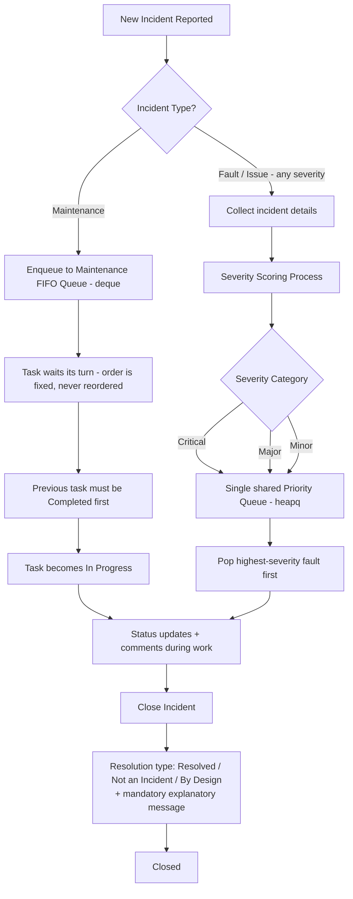
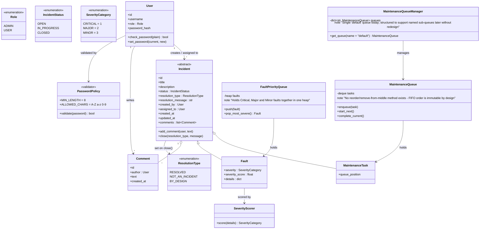

# Incident Bridge

**Status:** Draft v0.3 — Stage 1 (OOP model, data structures, iterators/generators, context managers)
**Course:** Advanced Programming — Project Stage 1
**Language versions:** This file (English) / `README_HE.md` (Hebrew) — both describe the same system.
**Changelog since v0.2:** Confirmed who may set each `ResolutionType` — Resolved is open to the assigned User or Admin; Not an Incident / By Design are Admin-only. No open questions remain. No tech stack changes.

> **Portability note:** This document is self-contained. Anyone picking this up fresh (a teammate, a future session, an instructor) should be able to understand the business process and design intent without needing prior conversation history.

> ⚠️ **Submission note:** The course assignment (Stage 1, Part A) requires the business proposal to be submitted as **its own separate `.md` file**, containing *no code or technical design*. The section below titled **"Part A – Project Proposal"** is written to satisfy that rubric exactly — copy that section alone into a new file (e.g. `PROJECT_PROPOSAL_EN.md`) for submission. Everything after it is supplementary system/technical design for internal team use across all project stages, and should **not** be submitted as Part A.

---

## Part A – Project Proposal

**Project name:** Incident Bridge
**One-sentence description:** An internal system for logging, prioritizing, and tracking routine maintenance tasks and operational faults across an organization's IT environment.

**Business need:** Teams currently lack a structured way to (a) ensure routine maintenance steps happen in the correct order without being skipped, and (b) make sure the most severe faults get attention first instead of being handled in arrival order. This leads to missed maintenance steps and delayed response to critical outages.

**Key users and roles:**
- **Admin** — IT manager / team lead. Full visibility over all incidents, can manage users, reclassify severity, and close incidents (including as "not an incident" or "by design").
- **User** — technician / support agent. Reports incidents, works assigned incidents, updates status, and adds comments.

**Main business process:** An incident is reported and classified as either *maintenance* or *fault/issue*. Maintenance tasks are placed into a strict first-in-first-out queue — a task cannot start before the previous one is completed, and the order can never be changed. Faults of every severity — Critical, Major, and Minor alike — are scored and placed into a single shared priority queue, so the most severe fault is always handled first regardless of when it arrived. Assigned staff update the incident's status and add comments until it is closed with a documented reason.

**Information flow:** Incoming — incident title, description, source system, and relevant details. Created/updated by — the reporting user, the assigned technician, and admins. Produced — a prioritized worklist per incident type, a full comment/update history per incident, and a documented closure reason.

**Business value:** Faster response to critical failures, no skipped or reordered maintenance steps, a clear audit trail of who did what and when (including *why* an incident was closed), reduced downtime, and improved user experience for the organization's internal customers.

**Core entities and relationships (high level):**
- A **User** creates and/or is assigned to **Incidents**.
- An **Incident** is either a **Maintenance Task** or a **Fault**.
- A **Fault** has exactly one **Severity Category** (Critical / Major / Minor), and every fault — regardless of category — goes through the same priority queue.
- An **Incident** has many **Comments**, each written by a **User**, and a mandatory closure message once resolved.

**Two main usage scenarios:**
1. A production system becomes unavailable. It is scored as *Critical*, jumps to the top of the shared fault priority queue ahead of any Major/Minor faults, and the on-call engineer is alerted, resolves it, and documents the steps taken via comments and a closing message.
2. A weekly batch of scheduled server maintenance tasks is queued in sequence. Each task must be marked complete before the next one can start, in strict, unchangeable order — not even an Admin can reorder or skip a task.

**Future expansion idea:** Connect the system to an external monitoring/alerting service so that real-time alerts automatically generate fault incidents instead of requiring manual entry.

---

## System Design (internal reference — not part of the Part A submission)

### 1. Business process, in detail



Key rules:
- **Maintenance = order matters, severity doesn't, order is immutable.**
- **Faults = severity matters, arrival order is only a tiebreaker, all severities share one queue.**
- **Every closure — whatever the reason — requires a mandatory written explanation.**

### 2. Severity scoring

The severity scoring process referenced in the course material (the "sheet" that turns incident details into a category) is modeled as a dedicated component, **not** hardcoded into the `Fault` class itself, so the scoring logic can be swapped or connected to an external service later without touching the domain model.

- **Input:** incident details (e.g. affected system, whether it's fully down vs degraded, number of users affected, whether it's security-related, data freshness, whether it's cosmetic).
- **Output:** a numeric score, mapped to exactly one of the three fixed categories.
- **Categories (fixed, no others allowed) — confirmed: all three go into the same fault priority queue, no separate lane for Minor:**
  1. **Critical** — system/major component unavailable or completely non-functional, security breach, etc.
  2. **Major** — performance degraded in a way that impacts user experience; components not working as expected.
  3. **Minor** — visual/text bugs, missing information, stale/non-latest data from an external source.

This scoring component is intentionally kept separate (its own module/class) so it can be replaced by a real external rules engine or ML-based scorer in a later stage without changing the queue or incident classes.

### 3. Why `deque` for maintenance, `heapq` for faults

- **Maintenance → `collections.deque`:** Maintenance is a pure FIFO queue with **no reordering, ever** — not even by an Admin. `deque` gives O(1) append/popleft, which is exactly what's needed to enforce "no task starts before the previous one finishes, and the order is fixed." The `MaintenanceQueue` class deliberately exposes **no** reorder/remove-from-middle/swap methods — only `enqueue` (append to the back) and `complete_current` → `start_next` (pop from the front). This is an intentional API restriction, not an oversight, so the FIFO guarantee can't be bypassed from anywhere else in the codebase.
- **Faults → `heapq`:** All faults — Critical, Major, and Minor alike — go into **one single shared priority queue**, so the most severe fault always surfaces first regardless of category or arrival order. `heapq` gives an efficient priority queue. The heap key is a tuple: `(severity_category.value, created_at)` — severity first (Critical=1, Major=2, Minor=3, so lower sorts first), and creation time as a tiebreaker so two faults of equal severity are still handled in arrival order.

### 4. Conceptual class model



Notes:
- `Incident` is the shared base class — both `MaintenanceTask` and `Fault` inherit its lifecycle (status, comments, timestamps, closure), while each subclass adds only what's specific to it. This keeps the model open for a 3rd incident type later without breaking existing code (Open/Closed principle).
- `close(resolution_type, message)` is a single method on `Incident` used for **all three** resolution types — "Resolved," "Not an Incident," and "By Design" are not separate code paths, just a required `ResolutionType` argument plus a mandatory, non-empty `message`. This directly reflects your confirmed decision that all three behave the same way, differing only in the reason recorded.
- `PasswordPolicy` is a single shared validator used both at user provisioning time (`.env`/seed) and at password-change time, so the rule is enforced consistently in exactly one place (no duplicated validation logic).
- Iteration over incidents (e.g. "give me the next N pending maintenance tasks" or "iterate all open faults") is a natural fit for **iterators/generators**, since Stage 1's syllabus covers exactly this — the queues can expose generator-based views instead of dumping their entire internal structure.
- Anything that touches shared/external state later (e.g. a connection to the future external service, or a log/report file) should go through a **context manager**, per the Stage 1 syllabus.

### 5. Incident lifecycle & actions (confirmed)

| Status | Meaning | Who can set it |
|---|---|---|
| Open | Reported, not yet started | System (on creation) |
| In Progress | Actively being worked | User / Admin |
| Closed | Terminal state — reached via `close()` with a `ResolutionType` + mandatory message | See resolution types below |

**Resolution types (all require a mandatory, non-empty explanatory message; all are functionally equivalent "closing" actions, differing only in the recorded reason):**

| Resolution type | Meaning | Who can set it |
|---|---|---|
| Resolved | The incident was fixed | User (assigned) or Admin |
| Not an Incident | Determined to be a non-issue | **Admin only** |
| By Design | Behavior is intentional | **Admin only** |

This is confirmed: any authenticated user working an incident can mark it Resolved, but reclassifying it as "Not an Incident" or "By Design" is restricted to Admins, consistent with severity changes also being Admin-only.

Additional actions surfaced in the incident detail page:
- Change severity (Fault only) — **Admin only**, since it affects queue ordering.
- Add comment/update — any authenticated user.
- Close incident (any resolution type) — per table above, always requires typing a message.

### 6. High-level architecture (Stage 1 preview of later stages)

- **Backend:** Python. **FastAPI** is the recommended framework: Pydantic models map naturally onto the OOP domain model, it auto-generates interactive API docs (Swagger/OpenAPI), it has native async support (useful once the external service integration is added in a later stage), and it needs minimal setup for a project this size.
- **Auth:** No self-registration. Users (username, password hash, role) are pre-provisioned via an `.env` file or a small local config/seed script — not through the API. Session handling via a signed session cookie (or a simple JWT) issued on login; role (`ADMIN` / `USER`) is embedded in the session and checked per endpoint.
- **Password policy (confirmed):** minimum **8 characters**; only characters `A–Z`, `a–z`, `0–9` are allowed (no spaces or symbols). Enforced by the single shared `PasswordPolicy` validator described in §4, applied identically whether a password is set at provisioning time or changed later.
- **Frontend:** Plain JavaScript (HTML/CSS/JS), communicating with the backend exclusively over the FastAPI REST endpoints (`fetch`), no server-side rendering required.
- **Frontend structure:**
  - **Login page** — username/password, no registration.
  - **Top bar** (persists across authenticated pages) — shows current user, includes an **account button** opening a modal/pop-up to change the current user's password. The modal requires the **current password**, a **new password**, and validates the new password client-side against the policy above before submitting (server re-validates regardless).
  - **Dashboard** — table/list of incidents with **filters** (type, severity, status, assignee) and **sorting** (severity, created date, status).
  - **Incident detail page** — full incident details, comment/update thread (add new comment as current user), role-appropriate action buttons (see §5), a **required message field** whenever closing the incident (any resolution type), and a **Back** button returning to the dashboard.
- **Future stages (not built yet, mentioned for continuity):**
  - Stage 2 — external service integration (auto-created faults from real alerts).
  - Stage 3 — automated tests.
  - Stage 4 — concurrency.

### 7. Suggested modular project structure

Kept deliberately modular per project requirement — new incident types, a new severity scorer, a new maintenance sub-queue, or a new frontend page should be addable without restructuring existing modules.

```
incident_bridge/
├── backend/
│   ├── app/
│   │   ├── models/            # domain models: User, Incident, MaintenanceTask, Fault, Comment, enums
│   │   ├── queues/
│   │   │   ├── maintenance_queue.py   # MaintenanceQueue (deque) + MaintenanceQueueManager
│   │   │   └── fault_queue.py         # FaultPriorityQueue (heapq) - single shared queue, all severities
│   │   ├── services/
│   │   │   ├── severity_scoring.py    # severity scoring logic (rule-based now, pluggable later)
│   │   │   └── password_policy.py     # shared password validation (min length + allowed chars)
│   │   ├── api/                # FastAPI routers: auth, incidents, comments, users
│   │   ├── auth/               # session/login logic, role-based access checks
│   │   └── main.py             # FastAPI app entrypoint
│   └── tests/                  # Stage 3
├── frontend/
│   ├── login.html
│   ├── dashboard.html
│   ├── incident.html
│   ├── js/
│   └── css/
├── docs/
│   ├── README_EN.md
│   ├── README_HE.md
│   ├── PROJECT_PROPOSAL_EN.md   # Part A only, copied out for submission
│   └── PROJECT_PROPOSAL_HE.md
└── .env.example
```

### 8. Confirmed design decisions (formerly open questions in v0.1)

| # | Question | Decision |
|---|---|---|
| 1 | Does Minor go through the priority queue too? | **Yes.** All severities (Critical/Major/Minor) share one `FaultPriorityQueue`. |
| 2 | Are "Not an Incident"/"By Design" separate from "Resolved"? | **No — functionally identical closing action.** All three go through `close(resolution_type, message)`, and all three **require** a mandatory explanatory message. |
| 3 | Can Admin reorder the maintenance queue? | **No, never.** FIFO is strictly immutable; `MaintenanceQueue` exposes no reorder/remove-from-middle capability at all. |
| 4 | Does the password-change modal require the current password? Any password rules? | **Yes**, current password is required. Policy: **minimum 8 characters, allowed characters only A–Z, a–z, 0–9.** |
| 5 | One global maintenance queue, or per-team queues? | **One queue for now** (`MaintenanceQueueManager` currently holds a single `"default"` queue), structured so additional named sub-queues can be added later without a redesign. |

| 6 | Who is allowed to set each `ResolutionType`? | **User (assigned) or Admin** can mark **Resolved**; **only Admin** can mark **Not an Incident** or **By Design**. |

All open questions from v0.1 are now resolved — no outstanding items.

---

## Tech stack (baseline — Stage 1)

- Backend: Python 3.x, FastAPI
- Frontend: HTML / CSS / vanilla JavaScript
- Data structures: `collections.deque` (maintenance, single FIFO queue, immutable order), `heapq` (single shared fault priority queue, all severities)
- Auth: pre-provisioned users (env/config), session cookie or JWT, 2 roles (Admin/User), shared password policy validator (min 8 chars, alphanumeric only)

