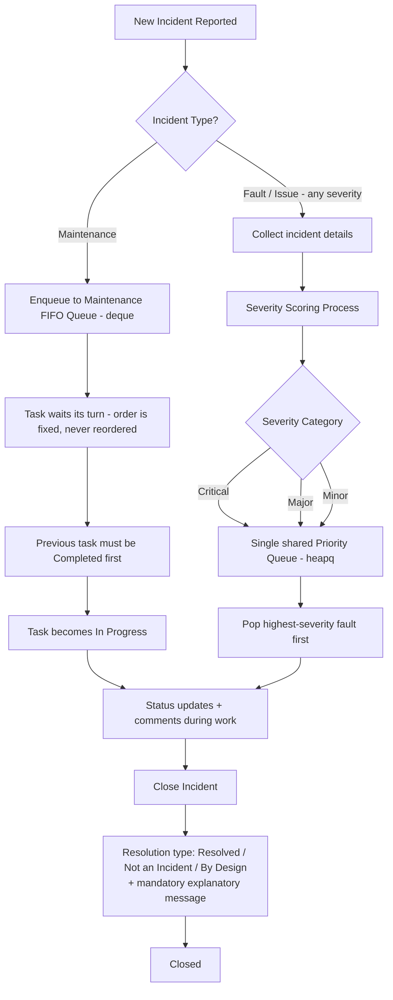

# Incident Bridge

**Status:** v0.4 — Stages 1–3 complete (OOP model, data structures, iterators/generators, context managers, persistence, live updates, and the automated test suite)
**Course:** Advanced Programming — Project
**Language versions:** This file (English) / `README_HE.md` (Hebrew) — both describe the same system. `README_HE.md` has not yet been updated to match this v0.4 revision; treat this file as authoritative until the Hebrew version is retranslated.
**Changelog since v0.3:** This revision documents the system as it actually stands today, not just as designed. Since v0.3 was written, the full backend (FastAPI app, session-based auth, all REST endpoints), the frontend (login/dashboard/incident-detail pages), SQLite persistence (incidents survive a restart), and Server-Sent-Events live updates (other users' changes appear without a manual refresh) were all built and verified — see the new **§6 Architecture — as built** below. This revision also adds the **Stage 3 automated test suite** (§9): 118 tests, unit and integration, running in CI via GitHub Actions on every push and pull request. No changes to the locked design decisions in §8, and no changes to the Part A business proposal below — the business need, users, and process are unchanged from v0.3.
**This file replaces the top-level `README.md`:** the project previously had a second, shorter `README.md` at the repository root (a quickstart pointing to `backend/README.md`). That file has been retired — everything it covered (how to run the app) is folded into **§10** below — so that project documentation lives entirely under `docs/`, alongside this file and `README_HE.md`.

> **Portability note:** This document is self-contained. Anyone picking this up fresh (a teammate, a future session, an instructor) should be able to understand the business process, the design intent, and the current implementation status without needing prior conversation history.

> ⚠️ **Submission note:** The course assignment (Stage 1, Part A) requires the business proposal to be submitted as **its own separate `.md` file**, containing *no code or technical design*. The section below titled **"Part A – Project Proposal"** is written to satisfy that rubric exactly — copy that section alone into a new file (e.g. `PROJECT_PROPOSAL_EN.md`) for submission. Everything after it is supplementary system/technical design and implementation-status documentation for internal team use across all project stages, and should **not** be submitted as Part A.

---

## Part A – Project Proposal

**Project name:** Incident Bridge
**One-sentence description:** An internal system for logging, prioritizing, and tracking routine maintenance tasks and operational faults across an organization's IT environment.

**Business need:** Teams currently lack a structured way to (a) ensure routine maintenance steps happen in the correct order without being skipped, and (b) make sure the most severe faults get attention first instead of being handled in arrival order. This leads to missed maintenance steps and delayed response to critical outages.

**Key users and roles:**
- **Admin** — IT manager / team lead. Full visibility over all incidents, can manage users, reclassify severity, and close incidents (including as "not an incident" or "by design").
- **User** — technician / support agent. Reports incidents, works assigned incidents, updates status, and adds comments.

**Main business process:** An incident is reported and classified as either *maintenance* or *fault/issue*. Maintenance tasks are placed into a strict first-in-first-out queue — a task cannot start before the previous one is completed, and the order can never be changed. Faults of every severity — Critical, Major, and Minor alike — are scored and placed into a single shared priority queue, so the most severe fault is always handled first regardless of when it arrived. Assigned staff update the incident's status and add comments until it is closed with a documented reason.

**Information flow:** Incoming — incident title, description, source system, and relevant details. Created/updated by — the reporting user, the assigned technician, and admins. Produced — a prioritized worklist per incident type, a full comment/update history per incident, and a documented closure reason.

**Business value:** Faster response to critical failures, no skipped or reordered maintenance steps, a clear audit trail of who did what and when (including *why* an incident was closed), reduced downtime, and improved user experience for the organization's internal customers.

**Core entities and relationships (high level):**
- A **User** creates and/or is assigned to **Incidents**.
- An **Incident** is either a **Maintenance Task** or a **Fault**.
- A **Fault** has exactly one **Severity Category** (Critical / Major / Minor), and every fault — regardless of category — goes through the same priority queue.
- An **Incident** has many **Comments**, each written by a **User**, and a mandatory closure message once resolved.

**Two main usage scenarios:**
1. A production system becomes unavailable. It is scored as *Critical*, jumps to the top of the shared fault priority queue ahead of any Major/Minor faults, and the on-call engineer is alerted, resolves it, and documents the steps taken via comments and a closing message.
2. A weekly batch of scheduled server maintenance tasks is queued in sequence. Each task must be marked complete before the next one can start, in strict, unchangeable order — not even an Admin can reorder or skip a task.

**Future expansion idea:** Connect the system to an external monitoring/alerting service so that real-time alerts automatically generate fault incidents instead of requiring manual entry.

---

## System Design (internal reference — not part of the Part A submission)

### 1. Business process, in detail



Key rules:
- **Maintenance = order matters, severity doesn't, order is immutable.**
- **Faults = severity matters, arrival order is only a tiebreaker, all severities share one queue.**
- **Every closure — whatever the reason — requires a mandatory written explanation.**

### 2. Severity scoring

The severity scoring process referenced in the course material (the "sheet" that turns incident details into a category) is modeled as a dedicated component, **not** hardcoded into the `Fault` class itself, so the scoring logic can be swapped or connected to an external service later without touching the domain model.

- **Input:** incident details (e.g. affected system, whether it's fully down vs degraded, number of users affected, whether it's security-related, data freshness, whether it's cosmetic).
- **Output:** a numeric score, mapped to exactly one of the three fixed categories.
- **Categories (fixed, no others allowed) — confirmed: all three go into the same fault priority queue, no separate lane for Minor:**
  1. **Critical** — system/major component unavailable or completely non-functional, security breach, etc.
  2. **Major** — performance degraded in a way that impacts user experience; components not working as expected.
  3. **Minor** — visual/text bugs, missing information, stale/non-latest data from an external source.

This scoring component is intentionally kept separate (its own module/class) so it can be replaced by a real external rules engine or ML-based scorer in a later stage without changing the queue or incident classes. **Implemented as:** `app/services/severity_scoring.py`'s `SeverityScorer` — a static, rule-based placeholder as originally planned, fully unit-tested (see §9).

### 3. Why `deque` for maintenance, `heapq` for faults

- **Maintenance → `collections.deque`:** Maintenance is a pure FIFO queue with **no reordering, ever** — not even by an Admin. `deque` gives O(1) append/popleft, which is exactly what's needed to enforce "no task starts before the previous one finishes, and the order is fixed." The `MaintenanceQueue` class deliberately exposes **no** reorder/remove-from-middle/swap method — only `enqueue` (append to the back) and `complete_current` → `start_next` (pop from the front). This is an intentional API restriction, not an oversight: the FIFO guarantee can never be bypassed from anywhere else in the codebase, not even by an admin (confirmed design decision — §8, #3).
- **Faults → `heapq`:** All faults — Critical, Major, and Minor alike — go into **one single shared priority queue**, so the most severe fault always surfaces first regardless of category or arrival order. `heapq` gives an efficient priority queue. The heap key is a tuple: `(severity.value, insertion_order)` — severity first (Critical=1, Major=2, Minor=3, so lower sorts first), and a monotonically increasing insertion counter as a tiebreaker so two faults of equal severity are still handled in arrival order.

**Implemented as:** `app/queues/maintenance_queue.py` (`MaintenanceQueue` + `MaintenanceQueueManager`) and `app/queues/fault_queue.py` (`FaultPriorityQueue`). Both are fully unit-tested, including the FIFO and priority-order guarantees themselves (see §9) — not just read, but actually exercised with real objects.

### 4. Conceptual class model


Notes:
- `Incident` is the shared base class — both `MaintenanceTask` and `Fault` inherit its lifecycle (status, comments, timestamps, closure), while each subclass adds only what's specific to it. This keeps the model open for a 3rd incident type later without breaking existing code (Open/Closed principle).
- `close(resolution_type, message)` is a single method on `Incident` used for **all three** resolution types — "Resolved," "Not an Incident," and "By Design" are not separate code paths, just a required `ResolutionType` argument plus a mandatory, non-empty `message`.
- `PasswordPolicy` is a single shared validator used both at user provisioning time (`.env`) and at password-change time, so the rule is enforced consistently in exactly one place.
- Iteration over incidents (e.g. "give me the next N pending maintenance tasks" or "iterate all open faults") is a natural fit for **iterators/generators** — both queues expose generator-based views (`MaintenanceQueue.pending_tasks()`, `FaultPriorityQueue.iter_by_severity()`) instead of dumping their entire internal structure.
- Anything that touches shared state during a block of work goes through a **context manager**: `app/context.py`'s `IncidentWorkSession` brackets a period of active work on an incident and guarantees the audit trail (a comment) reflects what happened, whether the block succeeds or raises.

### 5. Incident lifecycle & actions (confirmed)

| Status | Meaning | Who can set it |
|---|---|---|
| Open | Reported, not yet started | System (on creation) |
| In Progress | Actively being worked | User / Admin |
| Closed | Terminal state — reached via `close()` with a `ResolutionType` + mandatory message | See resolution types below |

**Resolution types (all require a mandatory, non-empty explanatory message; all are functionally equivalent "closing" actions, differing only in the recorded reason):**

| Resolution type | Meaning | Who can set it |
|---|---|---|
| Resolved | The incident was fixed | User (assigned) or Admin |
| Not an Incident | Determined to be a non-issue | **Admin only** |
| By Design | Behavior is intentional | **Admin only** |

Additional actions surfaced in the incident detail page:
- Change severity (Fault only) — **Admin only**, since it affects queue ordering.
- Add comment/update — any authenticated user, including on a closed incident.
- Close incident (any resolution type) — per table above, always requires typing a message.

---

### 6. Architecture — as built

Everything in this section describes what is actually running today, verified end-to-end (not just designed) — see §9 for how the automated test suite backs this up, and §10 for how to run it yourself.

**Backend.** FastAPI (`app/api/app.py`), served by Uvicorn. Pydantic models (`app/api/schemas.py`) map onto the OOP domain model in `app/models/`; interactive API docs are auto-generated at `/docs`.

**Auth.** No self-registration. Users (username, password hash, role) are pre-provisioned via the `INCIDENT_BRIDGE_USERS` environment variable, read once at startup (`app/repository.py`'s `seed_users_from_env`) — never through the API. Sessions use a signed cookie (Starlette's `SessionMiddleware`); the role is looked up from the session's username on every request, never trusted from client-supplied data.

**Password policy.** Minimum 8 characters, `A–Z`/`a–z`/`0–9` only. Enforced by the single shared `PasswordPolicy` validator (`app/services/password_policy.py`), applied identically at provisioning time and at password-change time (`User.set_password`).

**Persistence.** Incidents and their comments survive a process restart via SQLite (`app/persistence.py`'s `SqliteIncidentStore`). One SQLite connection is kept open for the process's life (required for a `:memory:` database to work at all, and used exactly this way by the test suite — see §9) and every access is serialized with a `threading.Lock`, since FastAPI runs its sync endpoint functions in a thread pool and more than one request can genuinely reach the database at the same time. At startup, `app/state.py`'s `AppState.create()` replays every persisted incident back into the right place: an `open` maintenance task re-enters the pending FIFO deque, the single `in_progress` task (if any) is restored directly as the queue's current item via `MaintenanceQueue.restore_current()`, an `open` fault re-enters the priority heap, and anything else (`closed`, or an already-claimed `in_progress` fault) is available for lookup only, matching runtime behavior. **Users are deliberately NOT persisted** — they always come from `INCIDENT_BRIDGE_USERS` at every startup; this stays a documented, explicit gap rather than an oversight. If a persisted incident references a username no longer in `INCIDENT_BRIDGE_USERS`, a clearly-labeled placeholder account (`"<name> (removed)"`) is substituted so old history stays readable instead of crashing startup.

**Live updates.** Other users' changes appear without a manual refresh, via Server-Sent Events (SSE) — not WebSockets, since the browser only ever needs one-way push here (mutations still go through the normal REST endpoints). `app/events.py`'s `EventBroadcaster` holds one `asyncio.Queue` per connected browser tab, keyed by that tab's self-chosen `client_id`; every mutating endpoint in `app/api/incidents.py` calls `broadcaster.publish(...)` right after the change is persisted. `GET /events?client_id=...` (`app/api/events.py`) is the long-lived SSE stream each tab connects to, with a 20-second keepalive so an idle connection isn't silently dropped by an intermediary proxy. Because route handlers are sync `def`s running in a thread pool while the SSE consumer lives on the asyncio event loop, handing an event across that boundary uses `loop.call_soon_threadsafe(...)` — the supported way to write to an `asyncio.Queue` from a different thread. A tab never receives its own change back (`X-Client-Id` header, generated per-tab in `sessionStorage` so two tabs of the same logged-in user count as separate subscribers) — verified live with two real concurrent SSE connections under the same account.

**Frontend.** Plain HTML/CSS/JS (no build step, no framework), served by the same FastAPI app via `StaticFiles` (same origin, so no CORS is needed for the normal deployment case). Pages: `index.html` (login), `dashboard.html` (maintenance queue + fault queue + filterable/sortable full incident list + new-incident dialog), `incident.html` (detail page with role/type/status-appropriate actions, comments, severity change). `frontend/js/row-list.js` patches existing row elements in place (matched by incident id) rather than rebuilding the DOM on every live-update event, so an unrelated list's rows are never touched and nothing flickers.

**Single-process constraint.** This app must run as a single process / single Uvicorn worker: the queues and the SQLite connection are plain in-memory/single-connection Python state, not shared across processes. Running multiple workers would give each one its own separate queues, silently breaking the "one shared FIFO" and "one shared priority queue" guarantees. Deployment target is Render.com as a single web service.

**Automated tests (Stage 3).** See §9 below — a full unit + integration test suite, run automatically in CI on every push and pull request via GitHub Actions.

**Not yet built:** Stage 2 external service integration (auto-created faults from real monitoring alerts); a dark/light theme toggle and renaming the account modal to "Settings" with an Interface tab; further concurrency/asyncio refinement beyond what persistence and live updates already introduced (Stage 4).

### 7. Project structure — as built

```
Incident_Bridge/
├── .github/
│   └── workflows/
│       └── backend-tests.yml   # CI: runs the backend test suite on every push/PR
├── backend/
│   ├── app/
│   │   ├── api/                # FastAPI routers, schemas, serializers, dependencies
│   │   │   ├── app.py          # app entrypoint: middleware, routers, exception mapping, static files
│   │   │   ├── auth.py         # /auth/login, /logout, /me, /change-password
│   │   │   ├── deps.py         # get_state / get_current_user / get_broadcaster / get_client_id
│   │   │   ├── events.py       # GET /events - the SSE stream
│   │   │   ├── incidents.py    # /incidents/... - maintenance + fault endpoints
│   │   │   ├── schemas.py      # Pydantic request bodies
│   │   │   └── serializers.py  # domain objects -> plain JSON-safe dicts
│   │   ├── models/             # domain models: User, Incident, MaintenanceTask, Fault, Comment, enums
│   │   ├── queues/              # MaintenanceQueue (deque) + FaultPriorityQueue (heapq)
│   │   ├── services/            # PasswordPolicy, SeverityScorer
│   │   ├── context.py          # IncidentWorkSession - context manager
│   │   ├── events.py           # EventBroadcaster - live-update fan-out
│   │   ├── persistence.py      # SqliteIncidentStore
│   │   ├── repository.py       # UserStore + IncidentRepository
│   │   └── state.py            # AppState - single in-memory container, rebuilt at startup
│   ├── tests/                  # Stage 3 - see §9
│   │   ├── conftest.py         # shared fixtures
│   │   ├── test_models/        # unit tests: User, Comment, Incident, MaintenanceTask, Fault
│   │   ├── test_services/      # unit tests: PasswordPolicy, SeverityScorer
│   │   ├── test_queues/        # unit tests: MaintenanceQueue, FaultPriorityQueue
│   │   ├── test_context.py     # unit tests: IncidentWorkSession
│   │   └── test_api/           # integration tests over real HTTP (TestClient)
│   ├── Resources/
│   │   └── seed_demo_data.py   # populates a running server with sample incidents
│   ├── README.md               # backend-specific reference (API table, persistence/live-update internals)
│   ├── requirements.txt        # runtime dependencies
│   ├── requirements-dev.txt    # test-only dependencies (pytest, pytest-cov)
│   ├── pytest.ini              # pytest configuration
│   ├── serve_app.py            # `python serve_app.py` - loads .env, then runs uvicorn
│   ├── smoke_test_api.py       # manual scripted HTTP walkthrough (predates the pytest suite)
│   └── sse_test.py             # manual two-tab live-update verification script
├── docs/
│   ├── README_EN.md            # this file
│   └── README_HE.md            # Hebrew version (not yet updated to v0.4)
└── frontend/
    ├── css/
    │   └── styles.css
    ├── js/
    │   ├── api.js               # fetch wrapper
    │   ├── dashboard.js
    │   ├── events.js            # SSE client + per-tab client_id
    │   ├── incident.js
    │   ├── login.js
    │   ├── row-list.js          # flicker-free row patching
    │   ├── toast.js
    │   └── topbar.js
    ├── dashboard.html
    ├── incident.html
    └── index.html
```

### 8. Confirmed design decisions (formerly open questions in v0.1)

| # | Question | Decision |
|---|---|---|
| 1 | Does Minor go through the priority queue too? | **Yes.** All severities (Critical/Major/Minor) share one `FaultPriorityQueue`. |
| 2 | Are "Not an Incident"/"By Design" separate from "Resolved"? | **No — functionally identical closing action.** All three go through `close(resolution_type, message)`, and all three **require** a mandatory explanatory message. |
| 3 | Can Admin reorder the maintenance queue? | **No, never.** FIFO is strictly immutable; `MaintenanceQueue` exposes no reorder/remove-from-middle capability at all. |
| 4 | Does the password-change modal require the current password? Any password rules? | **Yes**, current password is required. Policy: **minimum 8 characters, allowed characters only A–Z, a–z, 0–9.** |
| 5 | One global maintenance queue, or per-team queues? | **One queue for now** (`MaintenanceQueueManager` currently holds a single `"default"` queue), structured so additional named sub-queues can be added later without a redesign. |
| 6 | Who is allowed to set each `ResolutionType`? | **User (assigned) or Admin** can mark **Resolved**; **only Admin** can mark **Not an Incident** or **By Design**. |

All open questions from v0.1 are resolved — no outstanding design items remain.

---

### 9. Automated testing (Stage 3)

The backend has a full automated test suite under `backend/tests/`, running via [pytest](https://docs.pytest.org/), and executed automatically in CI (`.github/workflows/backend-tests.yml`) on every push and every pull request via GitHub Actions.

**Current results:** 118 tests, all passing, 89% overall statement coverage of `app/`.

**Two kinds of test, in two kinds of folder:**
- **Unit tests** (`tests/test_models/`, `tests/test_services/`, `tests/test_queues/`, `tests/test_context.py`) — no database, no HTTP, no FastAPI. These import the domain classes directly and exercise them in isolation: `PasswordPolicy`, `SeverityScorer`, `User`, `Comment`, `Incident` (via `MaintenanceTask` as a concrete stand-in, since `Incident` itself can't be instantiated), `MaintenanceTask`, `Fault`, `MaintenanceQueue`, `MaintenanceQueueManager`, `FaultPriorityQueue`, and `IncidentWorkSession`. These cover the guarantees the design depends on directly — e.g. that `heapq` genuinely pops Critical before Major before Minor regardless of insertion order, that closing with an admin-only resolution type as a non-admin raises `PermissionError`, that a weak password is rejected by `PasswordPolicy` and therefore by `User` itself.
- **Integration tests** (`tests/test_api/`) — spin up the real FastAPI app and hit it over real HTTP via FastAPI's `TestClient`, backed by a fresh in-memory SQLite database per test so nothing leaks between tests. These verify the whole stack together: routing, session-cookie auth, role-based permission enforcement, and the mapping from domain-level exceptions (`PermissionError` → 403, `ValueError` → 400, `RuntimeError` → 409, `IndexError`/`KeyError` → 404) to the right HTTP status — covering `/auth/*`, the maintenance FIFO endpoints, the fault priority-queue endpoints, and the shared comment/listing endpoints.

**Fixtures** (`tests/conftest.py`) provide `admin_client` and `user_client` — two independently logged-in sessions (their own cookies) that share the *same* backend state, so a test can simulate two different people working the same incident at once (e.g. a user creates a fault, an admin closes it).

**Run it locally** (see §10 for full setup):
```bash
cd backend
pip install -r requirements.txt -r requirements-dev.txt
python -m pytest -v
python -m pytest --cov=app --cov-report=term-missing   # with a coverage report
```

**What isn't covered yet:**
- `app/persistence.py` / `app/state.py`'s restart-replay path (building two separate `AppState` instances against the same on-disk database file to simulate an actual process restart) — the existing fixtures use `:memory:` databases that are discarded per test, by design, so this needs dedicated tests.
- `sse_test.py` (the two-tab live-update verification) stays a manual script for now — it needs concurrent real connections against a running server, which doesn't fit the same `TestClient`-per-test model as the rest of the suite without more infrastructure.

---

### 10. How to run everything

Requires Python 3.9+.

**Run the app:**
```bash
cd backend
pip install -r requirements.txt
cp .env.example .env   # then edit it - at minimum, change the demo passwords
python serve_app.py
```
`serve_app.py` loads `.env` itself (via `python-dotenv`), so `INCIDENT_BRIDGE_USERS`, `SESSION_SECRET_KEY`, `ALLOWED_ORIGINS`, `DATABASE_PATH`, and `HOST`/`PORT`/`RELOAD` all take effect automatically. If you use the plain `uvicorn` CLI instead (`uvicorn app.api.app:app --reload`), note that it does **not** load `.env` on its own — either use `serve_app.py`, or export those variables into your shell yourself first, or add `--env-file .env` to the command.

Open `http://127.0.0.1:8000/` — the FastAPI app serves the frontend directly (same origin, no CORS needed): `/` is the login page, the dashboard and incident-detail pages follow from there, the API itself lives alongside it at `/auth/*` and `/incidents/*`, and interactive docs are at `/docs`.

If `INCIDENT_BRIDGE_USERS` isn't set, it falls back to a demo pair for local testing only: `admin` / `Passw0rd1` (admin role) and `tech1` / `Passw0rd2` (user role). **Do not use this fallback outside local development.**

**Populate it with sample data** (optional, needs the server already running in another terminal):
```bash
python backend/Resources/seed_demo_data.py
```

**Run the automated test suite:**
```bash
cd backend
pip install -r requirements.txt -r requirements-dev.txt
python -m pytest -v
```
See §9 above for what's covered and how CI runs the same suite automatically.

**Manual verification scripts** (predate the pytest suite; kept as additional manual walkthroughs, not part of the automated suite):
```bash
python smoke_test_api.py   # scripted HTTP walkthrough of the whole API, in-memory database
python sse_test.py         # two simulated browser tabs verifying live-update delivery (needs the server already running)
```

---

## Tech stack (current)

- **Backend:** Python 3.x, FastAPI, Uvicorn
- **Frontend:** HTML / CSS / vanilla JavaScript (no build step, no framework)
- **Data structures:** `collections.deque` (maintenance, single FIFO queue, immutable order), `heapq` (single shared fault priority queue, all severities)
- **Auth:** pre-provisioned users (env/config), signed session cookie (Starlette `SessionMiddleware`), 2 roles (Admin/User), shared password policy validator (min 8 chars, alphanumeric only)
- **Persistence:** SQLite (`sqlite3`, stdlib), one persistent connection guarded by a `threading.Lock`
- **Live updates:** Server-Sent Events (`EventSource` client-side, `StreamingResponse` server-side), `asyncio.Queue` per connected browser tab, `threading` + `asyncio` bridged via `loop.call_soon_threadsafe`
- **Testing (Stage 3):** `pytest`, `pytest-cov`, FastAPI's `TestClient` (built on `httpx`) for integration tests
- **CI:** GitHub Actions (`.github/workflows/backend-tests.yml`) — runs the test suite on every push and pull request
- **Deployment target:** Render.com, single web service / single process
