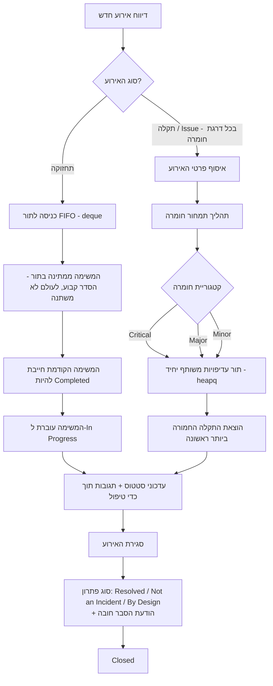
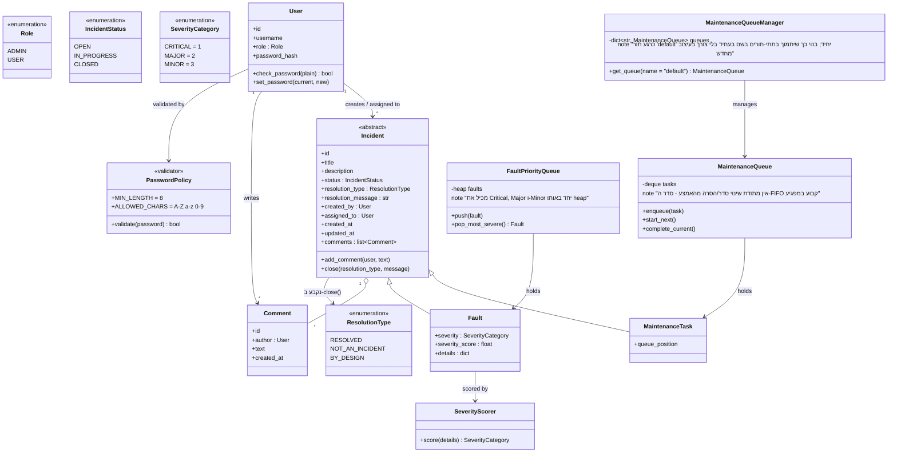

# Incident Bridge

**סטטוס:** טיוטה v0.3 — שלב 1 (מודל מונחה עצמים, מבני נתונים, Iterators/Generators, Context Managers)
**קורס:** תכנות מתקדם — פרויקט שלב 1
**גרסאות שפה:** קובץ זה (עברית) / `README_EN.md` (אנגלית) — שניהם מתארים את אותה מערכת.
**שינויים מאז v0.2:** אושר מי רשאי להגדיר כל `ResolutionType` — Resolved פתוח למשתמש המוקצה או ל־Admin; Not an Incident / By Design מוגבלים ל־Admin בלבד. לא נותרו שאלות פתוחות. אין שינוי במחסנית הטכנולוגית.

> **הערת ניידות מסמך:** מסמך זה עומד בפני עצמו. כל מי שנתקל בו לראשונה (חבר צוות, סשן עתידי, מרצה) אמור להבין את התהליך העסקי ואת כוונת העיצוב בלי צורך בהיסטוריית שיחה קודמת.

> ⚠️ **הערה לגבי הגשה:** לפי הוראות הקורס (שלב 1, חלק א), הצעת הפרויקט צריכה להיות מוגשת **בקובץ md נפרד**, ללא קוד או תכנון טכני. הסעיף שלהלן בשם **"חלק א – הצעת הפרויקט"** נכתב כך שיעמוד בדיוק בדרישה הזו — יש להעתיק רק את הסעיף הזה לקובץ חדש (למשל `PROJECT_PROPOSAL_HE.md`) לצורך ההגשה. כל מה שמופיע אחריו הוא תכנון מערכת/טכני משלים לשימוש פנימי של הצוות לאורך כל שלבי הפרויקט, ו**אין** להגיש אותו כחלק א'.

---

## חלק א – הצעת הפרויקט

**שם הפרויקט:** Incident Bridge
**תיאור במשפט אחד:** מערכת פנים־ארגונית לרישום, תיעדוף ומעקב אחר משימות תחזוקה שוטפות ותקלות/תפעול בסביבת ה־IT של הארגון.

**הצורך העסקי:** כיום חסרה בארגון דרך מובנית להבטיח (א) שמשימות תחזוקה שוטפות מתבצעות בסדר הנכון ולא מדלגות על שלבים, ו־(ב) שהתקלות החמורות ביותר מטופלות ראשונות במקום לפי סדר הגעה. הדבר גורם לפספוס שלבי תחזוקה ולתגובה איטית מדי לתקלות קריטיות.

**המשתמשים המרכזיים ותפקידיהם:**
- **Admin** — מנהל IT / ראש צוות. רואה את כל האירועים, יכול לנהל משתמשים, לשנות סיווג חומרה, ולסגור אירועים (כולל כ"לא תקלה" או כ"על פי תכנון").
- **User** — טכנאי / איש תמיכה. מדווח על אירועים, מטפל באירועים שהוקצו לו, מעדכן סטטוס ומוסיף תגובות.

**התהליך העסקי המרכזי:** אירוע מדווח ומסווג כ"תחזוקה" או כ"תקלה/issue". משימות תחזוקה נכנסות לתור FIFO קשיח — משימה לא יכולה להתחיל לפני שהקודמת הושלמה, והסדר לעולם לא ניתן לשינוי. תקלות בכל דרגות החומרה — Critical, Major ו־Minor כאחד — מקבלות ציון ונכנסות לתור עדיפויות משותף יחיד, כך שהתקלה החמורה ביותר תמיד מטופלת ראשונה ללא קשר למועד ההגעה. הצוות המוקצה מעדכן את הסטטוס ומוסיף תגובות עד לסגירת האירוע עם סיבה מתועדת.

**זרימת המידע:** קלט — כותרת האירוע, תיאור, מערכת מקור ופרטים רלוונטיים. יצירה/עדכון — המשתמש המדווח, הטכנאי המוקצה והמנהלים. פלט — רשימת עבודה מתועדפת לכל סוג אירוע, היסטוריית תגובות/עדכונים מלאה לכל אירוע, וסיבת סגירה מתועדת.

**הערך העסקי הצפוי:** תגובה מהירה יותר לתקלות קריטיות, אין דילוג או שינוי סדר בשלבי תחזוקה, יומן ביקורת ברור של מי עשה מה ומתי (כולל *למה* אירוע נסגר), צמצום זמן השבתה ושיפור חוויית המשתמש הפנים־ארגוני.

**הישויות המרכזיות והקשרים ביניהן (רמה כללית):**
- **User** יוצר ו/או מוקצה ל־**Incident**.
- **Incident** הוא או **Maintenance Task** או **Fault**.
- ל־**Fault** יש **קטגוריית חומרה** אחת בדיוק (Critical / Major / Minor), וכל תקלה — ללא קשר לקטגוריה — עוברת דרך אותו תור עדיפויות.
- ל־**Incident** יש **תגובות** רבות, כל אחת נכתבת ע"י **User**, וכן הודעת סגירה חובה עם הפתרון.

**שני תרחישי שימוש מרכזיים:**
1. מערכת production הופכת לבלתי זמינה. היא מקבלת ציון *Critical*, קופצת לראש תור התקלות המשותף לפני כל תקלת Major/Minor, והמהנדס התורן מקבל התראה, מטפל בתקלה ומתעד את הצעדים שננקטו באמצעות תגובות והודעת סגירה.
2. סבב שבועי של משימות תחזוקת שרתים נכנס לתור בסדר קבוע. כל משימה חייבת להיות מסומנת כהושלמה לפני שהבאה יכולה להתחיל, בסדר קשיח ובלתי ניתן לשינוי — אפילו Admin לא יכול לשנות סדר או לדלג על משימה.

**רעיון להרחבה עתידית:** חיבור המערכת לשירות ניטור/התרעות חיצוני כך שהתרעות בזמן אמת ייצרו אוטומטית אירועי תקלה, במקום הזנה ידנית.

---

## תכנון מערכת (חומר פנימי — אינו חלק מהגשת חלק א')

### 1. התהליך העסקי בפירוט



כללי מפתח:
- **תחזוקה = הסדר קובע, החומרה לא רלוונטית, הסדר בלתי ניתן לשינוי.**
- **תקלות = החומרה קובעת, סדר ההגעה משמש רק כשובר שוויון, כל דרגות החומרה חולקות תור אחד.**
- **כל סגירה — יהיה נימוקה אשר יהיה — דורשת הסבר כתוב חובה.**

### 2. תמחור חומרה (Severity Scoring)

תהליך תמחור החומרה שמוזכר בחומר הקורס (ה"גיליון" שהופך פרטי אירוע לקטגוריה) ממומש כרכיב נפרד ומודולרי, ו**לא** מוטמע ישירות בתוך מחלקת ה־`Fault`, כדי שניתן יהיה להחליף את לוגיקת התמחור או לחבר אותה לשירות חיצוני בהמשך מבלי לגעת במודל התחום עצמו.

- **קלט:** פרטי האירוע (למשל: האם המערכת הנפגעת לגמרי מושבתת או רק פוגעת בביצועים, מספר המשתמשים המושפעים, האם מדובר באירוע אבטחה, טריות הנתונים, האם מדובר בבאג ויזואלי בלבד).
- **פלט:** ציון מספרי, הממופה לאחת משלוש הקטגוריות הקבועות.
- **קטגוריות (קבועות, אין קטגוריות נוספות) — מאושר: שלושתן נכנסות לאותו תור עדיפויות תקלות, אין מסלול נפרד ל־Minor:**
  1. **Critical** — מערכת/רכיב מרכזי לא זמין או לא פועל כלל, פרצת אבטחה וכו'.
  2. **Major** — ירידה בביצועים הפוגעת בחוויית המשתמש; רכיבים לא פועלים כמצופה.
  3. **Minor** — באגים ויזואליים/טקסטואליים, מידע חסר, נתונים לא מעודכנים ממקור חיצוני.

הרכיב הזה נשמר בכוונה כמודול/מחלקה נפרדים, כדי שניתן יהיה להחליף אותו במנוע כללים חיצוני אמיתי או במודל מבוסס ML בשלב מאוחר יותר, מבלי לשנות את תורי העבודה או את מחלקות האירוע.

### 3. למה `deque` לתחזוקה ו־`heapq` לתקלות

- **תחזוקה → `collections.deque`:** תחזוקה היא תור FIFO טהור **ללא כל אפשרות לשינוי סדר** — גם לא ע"י Admin. `deque` מספק הוספה/הוצאה ב־O(1), בדיוק מה שנדרש כדי לאכוף "משימה לא מתחילה לפני שהקודמת הושלמה, והסדר קבוע". מחלקת `MaintenanceQueue` **לא חושפת בכוונה** אף מתודה לשינוי סדר/הסרה מהאמצע/החלפה — רק `enqueue` (הוספה לסוף) ו־`complete_current` → `start_next` (הוצאה מההתחלה). זוהי מגבלת API מכוונת, לא השמטה בטעות, כך שערבות ה־FIFO לא ניתנת לעקיפה משום מקום אחר בקוד.
- **תקלות → `heapq`:** כל התקלות — Critical, Major ו־Minor כאחד — נכנסות **לתור עדיפויות משותף יחיד**, כך שהתקלה החמורה ביותר תמיד עולה ראשונה ללא קשר לקטגוריה או לסדר ההגעה. `heapq` מספק תור עדיפויות יעיל. מפתח ה־heap הוא tuple: `(severity_category.value, created_at)` — חומרה קודם (Critical=1, Major=2, Minor=3, כך שערך נמוך יותר ממוין ראשון), וזמן היצירה כשובר שוויון כך ששתי תקלות באותה חומרה עדיין מטופלות לפי סדר הגעה.

### 4. מודל מחלקות מושגי



הערות:
- `Incident` היא מחלקת הבסיס המשותפת — גם `MaintenanceTask` וגם `Fault` יורשות ממנה את מחזור החיים (סטטוס, תגובות, חותמות זמן, סגירה), וכל תת־מחלקה מוסיפה רק את מה שספציפי לה. כך המודל נשאר פתוח לסוג אירוע שלישי בעתיד בלי לשבור קוד קיים (עקרון Open/Closed).
- `close(resolution_type, message)` היא מתודה יחידה על `Incident` שמשמשת **לכל שלושת** סוגי הפתרון — "Resolved", "Not an Incident" ו־"By Design" אינם נתיבי קוד נפרדים, אלא רק ארגומנט `ResolutionType` חובה יחד עם `message` חובה שאינו ריק. זה משקף ישירות את ההחלטה המאושרת שלך ששלושתם מתנהגים באותו אופן, ונבדלים רק בסיבה המתועדת.
- `PasswordPolicy` הוא validator משותף יחיד המשמש הן בשלב הקצאת המשתמשים (`.env`/seed) והן בשלב שינוי הסיסמה, כך שהכלל נאכף באופן עקבי במקום אחד בלבד (ללא שכפול לוגיקת ולידציה).
- מעבר על אירועים (למשל "תן לי את N משימות התחזוקה הממתינות הבאות" או "עבור על כל התקלות הפתוחות") מתאים באופן טבעי ל־**Iterators/Generators**, בדיוק מה שמכוסה בסילבוס של שלב 1 — התורים יכולים לחשוף views מבוססי generator במקום להחזיר את כל המבנה הפנימי שלהם.
- כל דבר שנוגע במשאב משותף/חיצוני בהמשך (למשל חיבור לשירות החיצוני העתידי, או קובץ לוג/דוח) צריך לעבור דרך **context manager**, בהתאם לסילבוס של שלב 1.

### 5. מחזור חיים ופעולות על אירוע (מאושר)

| סטטוס | משמעות | מי יכול להגדיר |
|---|---|---|
| Open | דווח, טרם החל טיפול | המערכת (ביצירה) |
| In Progress | בטיפול פעיל | User / Admin |
| Closed | מצב סופי — מושג דרך `close()` עם `ResolutionType` + הודעה חובה | ראו סוגי פתרון למטה |

**סוגי פתרון (כולם דורשים הודעת הסבר חובה שאינה ריקה; כולם פעולות "סגירה" זהות מבחינה פונקציונלית, ונבדלים רק בסיבה המתועדת):**

| סוג פתרון | משמעות | מי יכול להגדיר |
|---|---|---|
| Resolved | האירוע טופל ותוקן | User (המוקצה) או Admin |
| Not an Incident | הוגדר כלא־תקלה | **Admin בלבד** |
| By Design | ההתנהגות מכוונת | **Admin בלבד** |

הוחלט סופית: כל משתמש מחובר שמטפל באירוע יכול לסמן אותו כ־Resolved, אך סיווג מחדש כ־"Not an Incident" או "By Design" מוגבל ל־Admin בלבד, בהלימה לכך שגם שינוי חומרה מוגבל ל־Admin בלבד.

פעולות נוספות בעמוד פרטי האירוע:
- שינוי חומרה (רק ל־Fault) — **Admin בלבד**, מכיוון שזה משפיע על סדר התור.
- הוספת תגובה/עדכון — כל משתמש מחובר.
- סגירת אירוע (בכל סוג פתרון) — לפי הטבלה למעלה, תמיד דורשת הקלדת הודעה.

### 6. ארכיטקטורה כללית (תצוגה מקדימה לשלבים הבאים)

- **Backend:** Python. מומלץ **FastAPI**: מודלי Pydantic ממופים בטבעיות למודל התחום מונחה־העצמים, יש יצירה אוטומטית של תיעוד API אינטראקטיבי (Swagger/OpenAPI), תמיכה native ב־async (שימושי כשמחברים לשירות החיצוני בשלב מאוחר יותר), והגדרה מינימלית עבור פרויקט בהיקף הזה.
- **אימות (Auth):** אין הרשמה עצמית. משתמשים (שם משתמש, hash של סיסמה, תפקיד) מוגדרים מראש דרך קובץ `.env` או סקריפט seed/config מקומי קטן — לא דרך ה־API. ניהול session באמצעות עוגיית session חתומה (או JWT פשוט) שמונפקת בהתחברות; התפקיד (`ADMIN` / `USER`) משוקע ב־session ונבדק בכל endpoint.
- **מדיניות סיסמאות (מאושר):** מינימום **8 תווים**; מותרים אך ורק תווים `A–Z`, `a–z`, `0–9` (ללא רווחים או סימנים). נאכפת ע"י ה־validator המשותף `PasswordPolicy` המתואר בסעיף 4, ומיושמת באופן זהה הן בהגדרת סיסמה בעת הקצאת משתמש והן בשינוי סיסמה מאוחר יותר.
- **Frontend:** JavaScript רגיל (HTML/CSS/JS), מתקשר עם ה־backend אך ורק דרך endpoints של FastAPI REST (`fetch`), ללא צורך ב־server-side rendering.
- **מבנה ה־Frontend:**
  - **עמוד התחברות** — שם משתמש/סיסמה, ללא הרשמה.
  - **סרגל עליון** (מוצג בכל העמודים המאומתים) — מציג את המשתמש הנוכחי, כולל **כפתור חשבון** הפותח מודל/פופ־אפ לשינוי הסיסמה של המשתמש הנוכחי. המודל דורש **סיסמה נוכחית**, **סיסמה חדשה**, ומבצע ולידציה בצד הלקוח מול המדיניות שלמעלה לפני השליחה (השרת מבצע ולידציה חוזרת בכל מקרה).
  - **Dashboard** — טבלה/רשימה של אירועים עם **פילטרים** (סוג, חומרה, סטטוס, מוקצה למי) ו**מיון** (חומרה, תאריך יצירה, סטטוס).
  - **עמוד פרטי אירוע** — כל פרטי האירוע, שרשור תגובות/עדכונים (הוספת תגובה כמשתמש הנוכחי), כפתורי פעולה בהתאם לתפקיד (ראו סעיף 5), **שדה הודעה חובה** בכל סגירת אירוע (כל סוג פתרון), וכפתור **חזרה** לחזרה ל־Dashboard.
- **שלבים עתידיים (טרם נבנו, מוזכרים לצורך רציפות):**
  - שלב 2 — חיבור לשירות חיצוני (יצירת תקלות אוטומטית מהתרעות אמיתיות).
  - שלב 3 — בדיקות אוטומטיות.
  - שלב 4 — מקביליות.

### 7. מבנה פרויקט מודולרי מוצע

נשמר מודולרי בכוונה בהתאם לדרישת הפרויקט — הוספת סוג אירוע חדש, מנגנון תמחור חומרה חדש, תת־תור תחזוקה חדש, או עמוד frontend חדש אמורים להיות אפשריים בלי לפרק מודולים קיימים.

```
incident_bridge/
├── backend/
│   ├── app/
│   │   ├── models/            # מודלי תחום: User, Incident, MaintenanceTask, Fault, Comment, enums
│   │   ├── queues/
│   │   │   ├── maintenance_queue.py   # MaintenanceQueue (deque) + MaintenanceQueueManager
│   │   │   └── fault_queue.py         # FaultPriorityQueue (heapq) - תור משותף יחיד, כל דרגות החומרה
│   │   ├── services/
│   │   │   ├── severity_scoring.py    # לוגיקת תמחור חומרה (מבוססת כללים כרגע, ניתנת להחלפה בהמשך)
│   │   │   └── password_policy.py     # ולידציית סיסמה משותפת (אורך מינימלי + תווים מותרים)
│   │   ├── api/                # ראוטרים של FastAPI: auth, incidents, comments, users
│   │   ├── auth/               # לוגיקת session/login, בדיקות הרשאה לפי תפקיד
│   │   └── main.py             # נקודת כניסה של אפליקציית FastAPI
│   └── tests/                  # שלב 3
├── frontend/
│   ├── login.html
│   ├── dashboard.html
│   ├── incident.html
│   ├── js/
│   └── css/
├── docs/
│   ├── README_EN.md
│   ├── README_HE.md
│   ├── PROJECT_PROPOSAL_EN.md   # רק חלק א', מועתק להגשה
│   └── PROJECT_PROPOSAL_HE.md
└── .env.example
```

### 8. החלטות עיצוב מאושרות (לשעבר שאלות פתוחות ב-v0.1)

| # | שאלה | החלטה |
|---|---|---|
| 1 | האם גם Minor עובר דרך תור העדיפויות? | **כן.** כל דרגות החומרה (Critical/Major/Minor) חולקות `FaultPriorityQueue` אחד. |
| 2 | האם "Not an Incident"/"By Design" נפרדים מ"Resolved"? | **לא — פעולת סגירה זהה מבחינה פונקציונלית.** שלושתם עוברים דרך `close(resolution_type, message)`, ושלושתם **דורשים** הודעת הסבר חובה. |
| 3 | האם Admin יכול לשנות סדר בתור התחזוקה? | **לא, לעולם לא.** ה־FIFO קשיח ובלתי ניתן לשינוי; `MaintenanceQueue` לא חושפת כלל יכולת שינוי סדר/הסרה מהאמצע. |
| 4 | האם הפופ־אפ לשינוי סיסמה דורש את הסיסמה הנוכחית? האם יש כללי סיסמה? | **כן**, נדרשת הסיסמה הנוכחית. מדיניות: **מינימום 8 תווים, תווים מותרים בלבד A–Z, a–z, 0–9.** |
| 5 | תור תחזוקה גלובלי אחד, או תורים לפי צוות? | **תור אחד כרגע** (`MaintenanceQueueManager` מחזיק כרגע תור `"default"` יחיד), בנוי כך שניתן יהיה להוסיף תתי־תורים בשם בעתיד בלי צורך בעיצוב מחדש. |

| 6 | מי מורשה להגדיר כל `ResolutionType`? | **User (המוקצה) או Admin** יכולים לסמן **Resolved**; **רק Admin** יכול לסמן **Not an Incident** או **By Design**. |

כל השאלות הפתוחות מ־v0.1 הוכרעו כעת — אין פריטים נותרים.

---

## מחסנית טכנולוגית (בסיסית — שלב 1)

- Backend: Python 3.x, FastAPI
- Frontend: HTML / CSS / JavaScript רגיל
- מבני נתונים: `collections.deque` (תחזוקה, תור FIFO יחיד, סדר בלתי ניתן לשינוי), `heapq` (תור עדיפויות משותף יחיד לתקלות, כל דרגות החומרה)
- Auth: משתמשים מוגדרים מראש (env/config), עוגיית session או JWT, שני תפקידים (Admin/User), validator סיסמה משותף (מינימום 8 תווים, אלפאנומרי בלבד)

